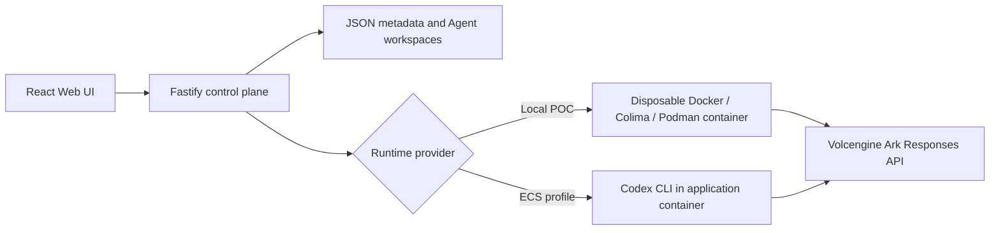

# Volc Agent Launchpad + WARRANT

> ## Selected middleware track: **B — The Bouncer (Identity and Authorization)**
>
> This repository implements **exactly one** judged track. The middleware is
> **WARRANT**: a delegation and authorization plane for multi-agent fan-out.
>
> One task is split into subtasks. Each subtask has **one accountable human** and
> **one Agent acting for them** under a scoped, expiring, revocable *warrant*.
> The backend decides every access; the browser decides none of them.
>
> | | |
> |---|---|
> | **Human principals** | `alice`, `bob` (mock, per section 8) plus an `orchestrator` |
> | **Agent principals** | one per subtask, derived from a warrant, always narrower than its owner |
> | **Protected resource** | each subtask workspace, plus the shared `branch:integration` |
> | **Required denial** | Alice's Agent reading Bob's workspace → `WB-6.cross-owner-denied` |
> | **Revocation** | an owner revokes a live warrant; the next action is refused, and no container is built |
> | **Physical isolation** | only the warranted directory is bound; siblings exist at no path in the namespace |
> | **Success test** | changing the user id in the request cannot bypass the decision |
> | **Shared state** | many Agents edit one document concurrently; no lost updates ([CONCORD](docs/CONCORD_SHARED_STATE.md)) |
>
> ```bash
> npm run demo:warrant   # the whole Track B story in your terminal, no Ark key needed
> npm run check          # typecheck + 403 tests + build
> ```
>
> **Team reference + roadmap:** [`docs/MASTER.md`](docs/MASTER.md) — start here.
>
> **Design:** [`docs/WARRANT_TRACK_B.md`](docs/WARRANT_TRACK_B.md) ·
> **Threat model:** [`docs/THREAT_MODEL.md`](docs/THREAT_MODEL.md) — the challenge's
> second recommended example, with an honest implemented/partial/not-built status
> against all seven threats.
>
> ### Also in this repository, and *not* our claimed track
>
> **AEGIS** (`apps/server/src/aegis/`) is safety and sandboxing work — Track C.
> It is retained as defence in depth because fan-out makes workspace isolation a
> real requirement, but **it is not what we are submitting**, and section 8
> permits this: *"you may, but they do not compensate for an incomplete selected
> track."* Judge us on Track B. Design:
> [`docs/MIDDLEWARE_ARCHITECTURE.md`](docs/MIDDLEWARE_ARCHITECTURE.md).
>
> The baseline Create → Start → Chat journey is unchanged.

A minimal Agent platform for three-day middleware hackathons. It provides Agent
CRUD, a browser Playground, persistent workspaces, and Codex CLI backed by the
Volcengine Ark Responses API.

Run it locally with Docker, Colima, or rootless Podman, or deploy it to
Volcengine ECS.

> [!WARNING]
> This is a single-user proof of concept. Do not use production data or
> credentials. See [SECURITY.md](SECURITY.md).
>
> The upstream starter kit ships with **no** identity, tracing, audit, or hardened
> sandbox middleware. This fork adds a **delegation and authorization plane**
> (Track B, judged) and **sandbox hardening** (Track C, retained but not claimed).
> Human principals are mock and unauthenticated by design — anyone who can reach
> the server can open a session as `alice`. What is enforced is what an Agent may
> do *once* a human has delegated to it. Limitations:
> [Track B](docs/WARRANT_TRACK_B.md#8-limitations-and-what-we-would-do-next) ·
> [Track C](docs/MIDDLEWARE_ARCHITECTURE.md#12-residual-risks-and-limitations).

## ⚠️ One switch decides the demo: `DEMO_MODE`

**Read this before running anything.** There are two demos in this repository
and one environment variable chooses between them. Nothing else needs to change.

| | `DEMO_MODE=single` *(default)* | `DEMO_MODE=multi` |
|---|---|---|
| **The demo** | one computer | several computers |
| **Binds to** | `127.0.0.1` — loopback | `0.0.0.0` — every interface |
| **Who can reach it** | only this machine | anyone on the same network |
| **Open** | `http://localhost:3000` | `http://<hostname>.local:3000` |
| **`APP_AUTH_TOKEN`** | not required | **required**, 24+ characters |

```bash
npm start                      # single — one computer, unchanged
DEMO_MODE=multi npm start      # multi  — reachable from other computers
```

**The server prints the exact URL to use, every time it starts:**

```
┌────────────────────────────────────────────────────────────────────┐
│  DEMO_MODE=multi  — reachable across the network                   │
├────────────────────────────────────────────────────────────────────┤
│  http://macbook-pro.local:3000   (other computers (mDNS))          │
│    ↳ needs Bonjour (macOS) or Avahi (Linux) on both machines       │
│  http://192.168.1.20:3000   (other computers (IP))                 │
│  http://localhost:3000   (this computer)                           │
└────────────────────────────────────────────────────────────────────┘
```

### How `multi` works

It uses **mDNS**, not a tunnel and not a hardcoded IP. macOS ships Bonjour and
most Linux distributions ship Avahi, so every machine already answers to
`<hostname>.local` on the local network. There is no new dependency, no daemon
of ours, and **no external service** — nothing leaves your network. All the
mode does is bind to every interface so that name leads somewhere, then print
the URL to hand your teammates.

**One computer is the server; the others are browser clients.** They install
nothing. This system runs as a single process — `JsonStore` supports one process
only, and the live activity bus is in-memory — so there is no peer-to-peer mode.

### `multi` requires an auth token

A server that executes agent code should not appear on a shared network without
one. Set any 24+ character URL-safe string:

```bash
DEMO_MODE=multi APP_AUTH_TOKEN="$(openssl rand -hex 16)" npm start
```

Starting `multi` without it fails immediately with an error saying so, rather
than quietly exposing an open server.

> [!WARNING]
> The shared token gates `/api/agents`. It deliberately does **not** gate
> `/api/warrant/`, `/api/concord/`, `/api/review/`, `/api/live/` or `/api/share/`
> — those carry per-human session tokens and authenticate themselves. Because
> human sign-in is mock, anyone who can reach the server in `multi` mode can
> open a session as `alice`, `bob` or the orchestrator. Use `multi` on a network
> you trust, for as long as the demo lasts.

### Troubleshooting `multi`

| Symptom | Cause | Fix |
|---|---|---|
| `APP_AUTH_TOKEN must contain at least 24 characters…` | `multi` without a token | set `APP_AUTH_TOKEN` (above) |
| Banner warns `DEMO_MODE=multi but HOST=127.0.0.1` | an explicit `HOST` overrode the mode | unset `HOST` — it always wins over the mode |
| `<hostname>.local` does not resolve | no Avahi on the Linux client or server | `sudo apt install avahi-daemon`, or use the IP line from the banner |
| Reachable by IP but not by name | mDNS blocked on the network | use the IP line |
| Nothing reaches you at all | Wi-Fi client isolation, or running under WSL2 | see below |

> [!NOTE]
> **WSL2:** the server sits on a private NAT (`172.x`) that other machines
> cannot route to, so `multi` alone is not enough. Either set
> `networkingMode=mirrored` in `%USERPROFILE%\.wslconfig` and run
> `wsl --shutdown`, or run the server on the host OS. macOS and native Linux
> need none of this.

`HOST` always wins when set explicitly — Docker Compose sets it, so Compose is
unaffected by this switch.

## Screenshots

### Agent Playground


### Create an Agent


## Features

- React and TypeScript Web UI
- Agent create, edit, start, stop, delete, and multi-turn chat
- Fastify control plane with asynchronous Run state
- Persistent Agent workspaces and Codex sessions
- Disposable Docker, Colima, or Podman container for each local turn
- Docker and Terraform deployment paths for Volcengine ECS

## Requirements

- Node.js 22+
- npm 10+
- Docker, Colima, or Podman
- A Volcengine Ark API key and endpoint that supports the Responses API

> [!IMPORTANT]
> `ARK_BASE_URL` must match the region your key was issued in. A key from the
> international console answers on `https://ark.ap-southeast.volces.com/api/v3`,
> and against the `cn-beijing` default every call returns
> `401 The API key doesn't exist` - which looks exactly like a bad key.

Codex CLI is included in the Runtime image and is not required on the host.

## The middleware console

The selected track is **B - The Bouncer**. Everything it decides is visible in
the browser: open the Playground and click **Middleware console** in the sidebar.

| Column | Answers |
| --- | --- |
| Shared documents | what shared state exists, and which Agent is on it right now |
| Document | what it says, who wrote each version, and any open conflict |
| Decision stream | the hash-chained decisions behind all of it, five-tuple per row |

Sign in as one of the mock humans, split a task with a shared path, and run an
Agent. Two Agents editing the same file resolve by merge; a genuine same-line
disagreement is held open until the human who owns the losing Agent settles it.
Running an Agent you do not own is refused by the backend, not hidden by the UI.

## Local browser SOP

### 1. Check the local tools

Install Node.js 22+ and one supported container engine, then verify them:

```bash
node --version
npm --version
docker --version        # Docker Desktop, Docker Engine, or Colima
podman --version        # Use this instead when running Podman
```

Only one container engine is required. Codex CLI is already included in the
Runtime image.

### 2. Clone the repository

```bash
git clone <repository-url> volc-agent-launchpad
cd volc-agent-launchpad
```

Skip this step when already working from the repository root.

### 3. Start the POC

```bash
ARK_API_KEY=your-ark-api-key \
ARK_MODEL=ep-your-endpoint-id \
npm run poc
```

The first run installs Node.js dependencies and builds the Runtime image. The
script automatically selects Docker, Colima, or Podman.

### 4. Open the browser

Visit <http://localhost:3000>, or open it from the terminal:

```bash
open http://localhost:3000       # macOS
xdg-open http://localhost:3000   # Linux desktop
```

In the Web UI:

1. Select **Create Agent**.
2. Enter a name, description, and workspace instructions.
3. Select **Create Agent** again.
4. Enter a task in the Playground, for example:

   ```text
   Create a TypeScript hello-world CLI, add a test, and run it.
   ```

The Agent can write files, run commands, and continue the same Codex session in
later messages.

### 5. Stop and resume

Press `Ctrl+C` in the startup terminal. The script removes temporary Runtime
containers but keeps Agent workspaces and conversations.

- macOS state: `~/.volc-agent-launchpad/`
- Linux state: `.local/`
- Custom location: set `LOCAL_POC_DATA_ROOT`

Run the same `npm run poc` command to continue later.

### Select a specific container engine

Force Podman when multiple engines are installed:

```bash
CONTAINER_ENGINE=podman \
ARK_API_KEY=your-ark-api-key \
ARK_MODEL=ep-your-endpoint-id \
npm run poc
```

Colima uses `CONTAINER_ENGINE=docker` because it exposes the Docker CLI.

For a clean Linux host, follow the
[rootless Podman setup](docs/LOCAL_POC.md#rootless-podman-on-linux).

## Docker Compose

Create and edit the configuration:

```bash
./scripts/bootstrap-local.sh
```

Required values in `.env`:

```dotenv
ARK_API_KEY=your-ark-api-key
ARK_MODEL=ep-your-endpoint-id
APP_AUTH_TOKEN=replace-with-at-least-24-random-characters
```

Start the application:

```bash
docker compose up --build
```

Open <http://localhost:3000>. Stop it without deleting Agent data:

```bash
docker compose down
```

## Development

```bash
npm install
cp .env.example .env
npm install --global @openai/codex@0.111.0
npm run dev
```

- Web UI: <http://localhost:5173>
- API: <http://localhost:3000>

Use local paths in `.env` when running outside Docker:

```dotenv
APP_DATA_DIR=.data
AGENT_WORKSPACE_ROOT=workspaces
CODEX_HOME=codex-home
```

## Deployment

- [Existing Linux ECS with Docker](docs/DEPLOYMENT.md#existing-linux-ecs)
- [Complete Volcengine environment with Terraform](docs/DEPLOYMENT.md#terraform-deployment)
- [Local Docker, Colima, and Podman details](docs/LOCAL_POC.md)

The existing-ECS script deploys from the current source tree:

```bash
cp .env.example .env.production
./scripts/deploy-existing-ecs.sh .env.production
```

The Terraform path provisions VPC, subnet, security group, ECS, and EIP:

```bash
cp deploy/volcengine/terraform.tfvars.example \
  deploy/volcengine/terraform.tfvars
./scripts/deploy-volcengine.sh
```

## Configuration

| Variable | Default | Purpose |
| --- | --- | --- |
| **`DEMO_MODE`** | **`single`** | **`single` = one computer (loopback). `multi` = several computers (all interfaces + mDNS). [See above](#️-one-switch-decides-the-demo-demo_mode).** |
| `HOST` | from `DEMO_MODE` | Explicit bind address. Always wins over `DEMO_MODE`. |
| `ARK_API_KEY` | Required | Ark model API key. |
| `ARK_MODEL` | Required | Responses-capable endpoint or model ID. |
| `ARK_BASE_URL` | Beijing v3 endpoint | Ark OpenAI-compatible API URL. **Must match your key's region** - international keys need `https://ark.ap-southeast.volces.com/api/v3`. |
| `APP_AUTH_TOKEN` | Empty on loopback | Shared demo token; use 24+ random characters remotely. |
| `RUNTIME_PROVIDER` | `local-process` | `container` for disposable local Runtime containers. |
| `CODEX_SANDBOX_MODE` | `workspace-write` | Codex inner sandbox mode. |
| `CODEX_TIMEOUT_MS` | `600000` | Maximum duration of one turn. |
| `LOCAL_POC_DATA_ROOT` | Platform-specific | Local metadata, workspace, and session directory. |

See [.env.example](.env.example) for all Runtime and resource-limit options.

## How it works



The first turn uses `codex exec`; later turns resume the stored Codex thread.
Deleting an Agent archives its workspace under `workspaces/.deleted/`.

See [docs/ARCHITECTURE.md](docs/ARCHITECTURE.md) for component and extension
boundaries.

## Validation

```bash
npm run check
terraform fmt -check -recursive deploy/volcengine
docker compose config
```

## Documentation

- [Architecture](docs/ARCHITECTURE.md)
- [Local POC](docs/LOCAL_POC.md)
- [Deployment](docs/DEPLOYMENT.md)
- [Hackathon extension guide](docs/HACKATHON_EXTENSION_GUIDE.md)
- [Security policy](SECURITY.md)
- [Contributing](CONTRIBUTING.md)

## License

[MIT](LICENSE)
