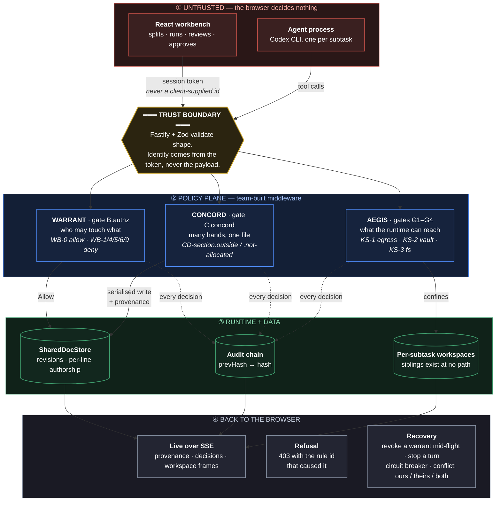

# One-page architecture

One task is split into subtasks. Each subtask has **one accountable human** and
**one Agent acting for them** under a scoped, expiring, revocable *warrant*. The
backend decides every access; the browser decides none of them.

> **Rendered image:** [`docs/assets/architecture.png`](docs/assets/architecture.png)
> — the same page as a picture, for slides and anywhere Mermaid does not render.

## Where each thing happens

| | Point | What it is | Where |
| --- | --- | --- | --- |
| **Trust boundary** | Fastify + Zod | Shape is validated; identity is taken from the session token, never from a client-supplied id | `apps/server/src/app.ts`, `warrant/access.ts` |
| **Enforcement** | `B.authz` | One human, one Agent, one warrant. `WB-6.cross-owner-denied` is the required denial | `warrant/plane.ts` |
| **Enforcement** | `C.concord` | Section allocation checked on the **diff**, not the payload, inside the write's critical section | `concord/sections.ts` |
| **Enforcement** | `G1–G4` | Preflight, confinement, interception, postflight around the Agent process | `aegis/policy/bundle.ts` |
| **Instrumentation** | Audit chain | Every decision appended with `prevHash → hash`, so the record is verifiable and ordered | `aegis/audit.ts` |
| **Instrumentation** | Live feed | Provenance, decisions and workspace frames streamed to the browser over SSE | `live/routes.ts` |
| **Recovery** | Revocation | An owner revokes a live warrant; the next action is refused and no container is built | `warrant/routes.ts` |
| **Recovery** | Containment | A policy violation latches that Agent's circuit breaker | `aegis/index.ts` |
| **Recovery** | Merge gate | Closed until every Agent is approved **by its own human** and nothing is contested | `warrant/orchestrator.ts` |

## The one-sentence version of each plane

- **WARRANT** — a delegation plane. A warrant is always *narrower* than the human
  who issued it, expires, and can be revoked mid-flight. Changing the user id in
  a request cannot change the answer, because the id is never read from the
  request.
- **CONCORD** — a concurrency plane. Many Agents edit one document; writes are
  serialised, each Agent is confined to its allocated section, and every line
  carries the Agent that last changed it, which is what routes a review comment.
- **AEGIS** — a sandbox plane. Retained as defence in depth because fan-out makes
  workspace isolation a real requirement.

> The orchestrator holds no workspace authority, deliberately. An agent that
> can read every workspace is the single principal an attacker needs — the
> classic confused deputy. It splits, assigns and integrates, and nothing else.
