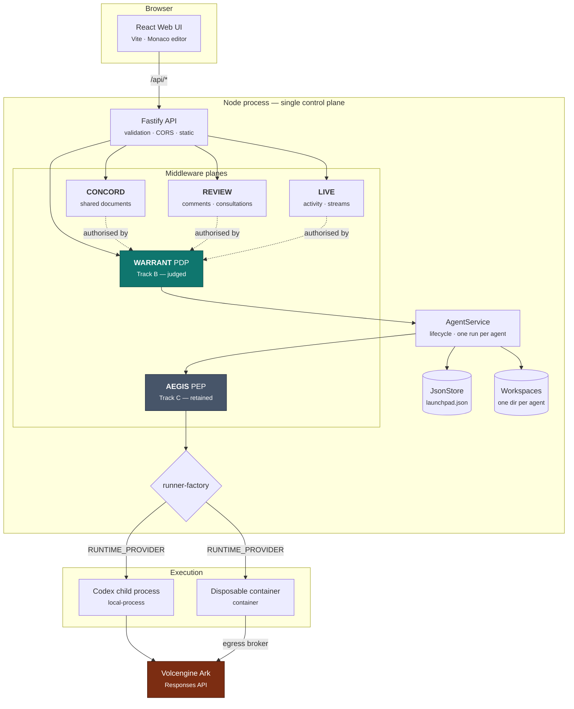
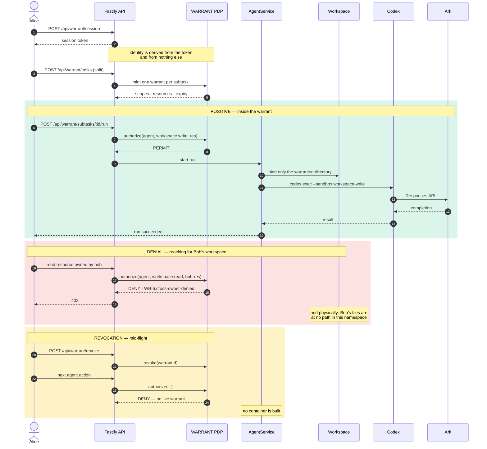
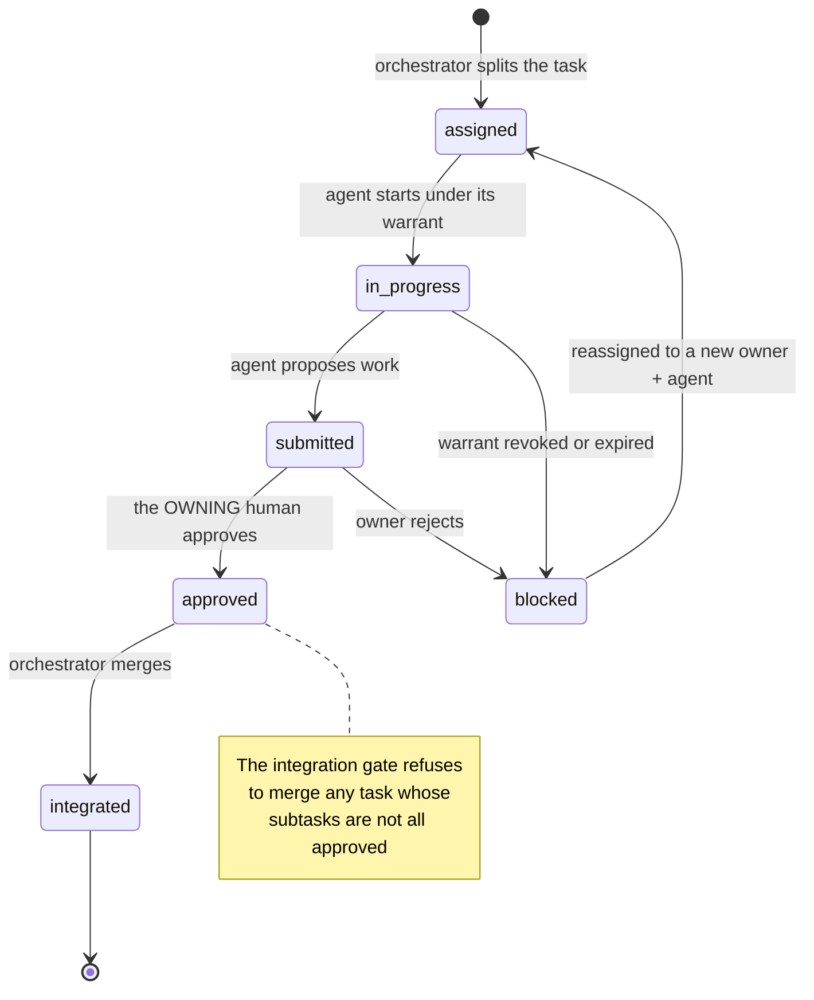
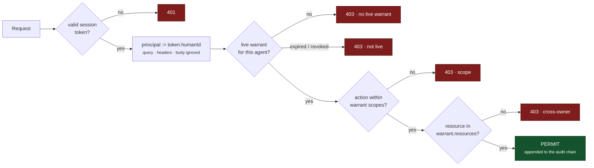
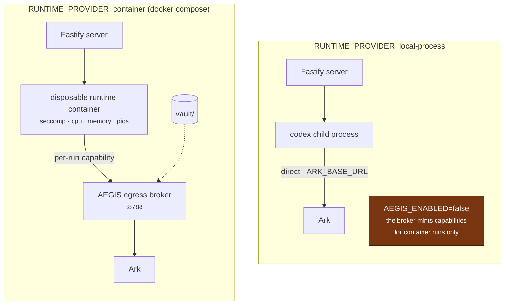

# Architecture Diagram

Volc Agent Launchpad + **WARRANT**. Diagrams are Mermaid, so they render
directly on GitHub with no toolchain. A LaTeX/TikZ source for the main diagram
is in [appendix A](#appendix-a--latex--tikz-source) if you need a PDF or a
slide.

---

## 1. System context

Everything the browser asks for passes the **PDP** before it reaches data.



**The key line:** the browser never decides an authorization question, and it
never sees the Ark API key.

---

## 2. A warranted run, end to end

The positive path and the denial, side by side — this is the core of Track B.



---

## 3. Subtask state machine



---

## 4. The authorization decision

Every `/api/*` call that touches data resolves through one path. There is no
ambient permission and no second way in.



**The success test:** changing the user id in the request — query param, header,
or body field — cannot bypass this, because `principal` is taken from the
session token before any of them are read.

---

## 5. Runtime topology

The same control plane, two execution modes, selected by `RUNTIME_PROVIDER`.



| | local-process | container |
|---|---|---|
| Isolation | OS process, `--sandbox workspace-write` | namespace + seccomp + cgroup limits |
| Egress | direct to `ARK_BASE_URL` | mediated by the AEGIS broker |
| Sibling workspaces | not mounted | exist at no path in the namespace |
| Aegis | must be **off** outside Compose | on |

---

## 6. Component map

| Path | Plane | Responsibility |
|---|---|---|
| `apps/web/src/` | — | React UI: agents, console, code editor, review, collab |
| `apps/server/src/app.ts` | — | Route registration, CORS, bearer check, static serving |
| `apps/server/src/agent-service.ts` | — | Agent lifecycle, one active run per agent |
| `apps/server/src/store.ts` | — | `JsonStore` — serialised writes, atomic replace, single process |
| `apps/server/src/runner-factory.ts` | — | Chooses `codex-runner` or `container-codex-runner` |
| `apps/server/src/warrant/` | **WARRANT** | PDP, registry, orchestrator, splitter, model policy, sharing, binding |
| `apps/server/src/concord/` | CONCORD | sections, three-way merge, reconcile, checkpoint, provenance |
| `apps/server/src/review/` | REVIEW | comments, consultations, reiterations |
| `apps/server/src/live/` | LIVE | activity feed, workspace streams, board |
| `apps/server/src/aegis/` | AEGIS | policy engine, egress broker, seccomp, ledger, breaker, attestation |

### Agent lifecycle

```
ready ──▶ busy ──▶ ready
  │         │
  ▼         ▼
stopped   error
```

Runs interrupted by a restart become `cancelled`.

---

## Appendix A — LaTeX / TikZ source

For a PDF or slide version of §1. Compile with `pdflatex` (needs
`tikz` + `positioning` + `fit`).

```latex
\documentclass[border=12pt]{standalone}
\usepackage{tikz}
\usetikzlibrary{arrows.meta, positioning, fit, backgrounds}

\begin{document}
\begin{tikzpicture}[
  font=\sffamily\small,
  node distance=9mm and 14mm,
  box/.style   = {rectangle, rounded corners=2pt, draw=black!55,
                  fill=white, minimum height=9mm, minimum width=30mm,
                  align=center},
  judged/.style= {box, fill=teal!75!black, text=white, draw=teal!40!black},
  retain/.style= {box, fill=black!55, text=white, draw=black!75},
  ext/.style   = {box, fill=orange!80!black, text=white, draw=orange!45!black},
  store/.style = {box, cylinder, shape border rotate=90, aspect=0.20},
  flow/.style  = {-{Stealth[length=2mm]}, draw=black!65},
  dash/.style  = {flow, dashed}
]

\node[box]    (ui)    {React Web UI};
\node[box, below=of ui] (api) {Fastify API};

\node[judged, below=of api]            (pdp)     {WARRANT PDP\\\scriptsize Track B};
\node[box,   left=of pdp]              (concord) {CONCORD\\\scriptsize documents};
\node[box,   right=of pdp]             (live)    {REVIEW / LIVE};

\node[box,    below=of pdp]  (svc)  {AgentService};
\node[store,  left=of svc]   (db)   {JsonStore};
\node[store,  right=of svc]  (wsp)  {Workspaces};

\node[retain, below=of svc]  (pep)  {AEGIS PEP\\\scriptsize Track C};
\node[box,    below=of pep]  (run)  {runner-factory};
\node[box,    below left=of run]  (proc) {codex process};
\node[box,    below right=of run] (cont) {container};
\node[ext,    below=18mm of run]  (ark)  {Volcengine Ark};

\draw[flow] (ui)  -- node[right,font=\scriptsize]{/api/*} (api);
\draw[flow] (api) -- (pdp);
\draw[flow] (api) -| (concord);
\draw[flow] (api) -| (live);
\draw[dash] (concord) -- node[above,font=\scriptsize]{authorised by} (pdp);
\draw[dash] (live)    -- node[above,font=\scriptsize]{authorised by} (pdp);
\draw[flow] (pdp) -- (svc);
\draw[flow] (svc) -- (db);
\draw[flow] (svc) -- (wsp);
\draw[flow] (svc) -- (pep);
\draw[flow] (pep) -- (run);
\draw[flow] (run) -- (proc);
\draw[flow] (run) -- (cont);
\draw[flow] (proc) -- (ark);
\draw[flow] (cont) -- node[right,font=\scriptsize]{broker} (ark);

\begin{scope}[on background layer]
  \node[draw=black!25, dashed, rounded corners, fit=(pdp)(concord)(live),
        label={[font=\scriptsize\itshape]above right:middleware planes}] {};
\end{scope}
\end{tikzpicture}
\end{document}
```

---

**Related:** [`marcel anjing.md`](marcel%20anjing.md) (workflow) ·
[`docs/ARCHITECTURE.md`](docs/ARCHITECTURE.md) ·
[`docs/MIDDLEWARE_ARCHITECTURE.md`](docs/MIDDLEWARE_ARCHITECTURE.md) ·
[`docs/WARRANT_TRACK_B.md`](docs/WARRANT_TRACK_B.md)
