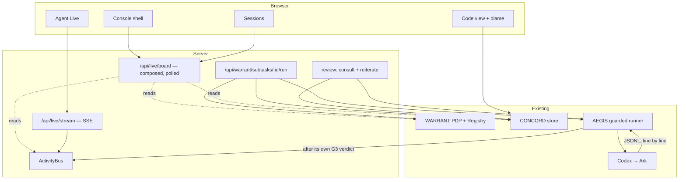

# Multiplayer-IDE inspiration — what we took, adapted, and refused

The reference is a product reel for a "multiplayer IDE" pitched as *Google Docs
for AI agents*. It is inspiration, not a spec: no branding, logo, wording or
asset is reproduced, and the layout is rebuilt on this repo's own design tokens.

The reel makes ten claims. This document says, for each one, whether the claim
is true of **this** platform, what backs it, and where we stopped.

> The rule everything below is measured against: **nothing may be rendered as
> live, accepted, denied or in progress unless a backend record says so.** A
> truthful section-level presence indicator beats a convincing fake cursor,
> because the fake one is the single thing a judge can catch us on.

---

## 1. The scorecard

| # | Claim in the reel | Status here | What backs it |
| --- | --- | --- | --- |
| 1 | Several people's Agents run at once | ✅ | One Agent per subtask, one warrant each, separate workspaces; CONCORD serialises the writes |
| 2 | Every Agent knows what the others built | ⚠️ | True at **turn boundaries**: `materialize` hands the Agent the committed version before the turn, `reconcile` submits after. Not continuous. |
| 3 | Agents receive live shared context | ⚠️ | Same boundary. The envelope is the document at its committed revision, not a stream. |
| 4 | Agents stay grounded in current information | ✅ | An Agent that started from a stale revision is merged or conflicted, never silently accepted |
| 5 | Agents build in parallel | ✅ | Independent regions merge; both survive |
| 6 | Agents do not overwrite one another | ✅ | Three-way merge; same-line overlap becomes a held conflict a human settles |
| 7 | All the team's sessions in one place | ✅ | Sessions dashboard, from the Orchestrator's tasks |
| 8 | See what every Agent is typing, live | ⚠️→✅ | **Agent Live** streams the runtime's own event feed over SSE — its real commands, file changes, reasoning and messages. Not keystrokes: the runtime reports completed items, so "typing" is as granular as it gets. |
| 9 | See where each Agent's cursor is | ⚠️ | **Adapted.** A caret marks where an Agent's last commit ENDED, to the character, computed by `reconcileProvenance` from the diff CONCORD already runs. Not a keystroke position, and it does not move during a turn. See §5. |
| 10 | See what teammates are prompting | ✅ | The human's own prompt is published to the feed, truncated; the compiled prompt never is |

---

## 2. Feature inventory and decisions

| Reel feature | Evidence in the reel | Existing support | Backend work | Frontend work | Value | Cost | Decision |
| --- | --- | --- | --- | --- | --- | --- | --- |
| Dark IDE shell, revision badge, file tabs | A | theme + tabstrip | — | tab dots, close, rev badge | med | S | **Implemented** |
| Syntax-highlighted editor | A | plain lines | — | Monaco | med | M | **Implemented** - Monaco, see §5 |
| Multiple panes / "New pane" | A | one pane | — | tab set | low | M | **Adapted** — multiple open tabs, one visible pane |
| Collaboration sidebar with badges | B | 3 panels | `/api/live/board` | 8 panels | high | M | **Implemented** |
| Activity / evidence feed with filters | C | decision chain | — | filters, Problems tab | high | S | **Implemented** |
| Sharing + permission roles | D | WARRANT | `/api/live/access` | access panel | high | M | **Adapted** — the role is a *rendering of warrant scopes*, not a stored setting |
| Sessions dashboard | E | tasks in memory | board sessions | session cards | high | M | **Implemented** |
| Live presence, colour per participant | F | CONCORD presence | — | colour derivation | high | S | **Implemented** at document level |
| "Agent Live" panel | G | nothing | tap + SSE | live feed | **highest** | M | **Implemented** |
| Subagents | H | orchestrator fan-out | board sessions | tree | med | S | **Adapted** — one honest level; see §5 |
| Queue and handoff | I | subtask states | board queue | queue panel | med | S | **Partial** — queue yes, takeover no |
| Inline comments | J | review loop | — | already built | high | — | Already shipped |
| Session capability mode | K | WARRANT | board people | status bar | med | S | **Implemented** |
| Usage / provider attribution | L | `RunUsage` | usage totals | usage panel | med | S | **Implemented** |
| Live character cursors | F | provenance diff | caret on `ProvenanceUpdate` | caret decoration | high | S | **Adapted** - commit carets, see §5 |
| Agent typing animation | G | — | — | — | — | — | **Refused** |
| macOS build, beta signup, org invites | M | — | — | — | — | — | Out of scope |

---

## 3. Architecture



**The one seam that matters.** Codex emits JSONL; both runners already hand
every line to `inspect` so AEGIS can enforce G3. The live feed taps *that same
line*, after AEGIS has cleared it. So:

- every row on the board is a line the runtime actually emitted;
- the observer's return value is **ignored** by the guarded runner, so watching
  a run can never abort one;
- an observer that throws cannot take the guard down with it.

`live/routes.ts` composes and never stores. Sessions come from the Orchestrator,
people and roles from the Registry's warrants, presence and conflicts from
CONCORD, comments from the review service, usage from `RunnerResult`.

---

## 4. Contracts

```
GET  /api/live/board      { viewer, scope, sessions[], people[], queue[], usage[], activity[] }
GET  /api/live/activity   { viewer, events[] }        ?limit=1..300
GET  /api/live/stream     text/event-stream           ?token=<session>
GET  /api/live/access     { viewer, warrants[] }
```

`ActivityEvent`:

```ts
{ id, at, agentId, subtaskId, humanId, purpose, kind, detail, usage? }
purpose: "turn" | "consultation" | "reiteration"
kind:    "prompt" | "turn-started" | "thinking" | "message"
       | "command" | "file-change" | "turn-completed" | "blocked"
```

`detail` is collapsed and hard-truncated to 300 characters before it is
published. Full file contents, whole prompts and credentials never enter it.

**Scope.** A human sees their own Agents; the orchestrator sees all — the rule
the decision chain already used. It is re-resolved **per event** on the stream,
not captured at connect time. That distinction was a live bug: see §7.

**SSE and the token.** `EventSource` cannot set an `Authorization` header, so
the stream — and only the stream — also accepts the session token as a query
parameter. That is a real trade (query strings reach access logs; headers do
not), taken knowingly for a short-lived demo token, against the alternative of
a WebSocket dependency for one strictly one-way feed.

**Why SSE and not WebSockets.** The feed is one-way, needs no new dependency,
survives an HTTP-only proxy, and reconnects on its own. The board poll carries
the same events, so a browser that cannot hold a stream open is two seconds
behind rather than wrong — the UI merges the two and de-duplicates by id.

---

## 5. What we refused, and why

**Live character cursors — revised 2026-08-31. The refusal below was right
about keystrokes and wrong about the conclusion.**

The original argument: the runtime reports *items* — a completed command, a file
change, a message — not keystrokes, so a cursor gliding through a file would be
an animation with no backing record.

Every word of that still holds, and none of it applies to what is now built.
There **is** a character-precise position CONCORD genuinely knows, and it knows
it for free: `reconcileProvenance` already diffs the previous content against
the next one inside the commit critical section in order to attribute lines. At
the moment it pushes the last inserted line of the last hunk, that line's number
is `lines.length`, and the column is one string comparison away — one past the
last character that actually differs from the line being replaced.

So a caret here means exactly one thing: **the character position at which that
Agent's last committed edit ended, at the revision its label names.** It is
arithmetic over two strings the store already holds. It rides on
`PresenceEntry.caret` under the same 15-second TTL as the rest of presence, and
durably on `AgentContribution.caret`.

What is still refused, for the original reason:

- The caret does **not** move during a turn. Between two commits there is no
  position to report, so none is invented. Mid-turn the honest signal is *which
  file*, which is the dot on the tab.
- **No interpolation.** Easing a caret between two committed positions would be
  an animation rather than a measurement. The caret jumps. The only transition
  on it is opacity, which is presentation, not invented data.

Tests: `concord/provenance.test.ts`, "commit caret" — insertion at end of file,
a mid-line replacement that must stop before the shared suffix, multi-hunk (the
last one wins), an unchanged commit (no caret), and a first write.

**Agent typing animation.** Same reason. The feed shows completed items, at the
moment they were reported.

**Role dropdowns.** In the reel a role is a setting on a person. Here it is
derived from a warrant's scopes (`workspace:write` → Editor, `merge:propose` →
Commenter, `workspace:read` → Viewer). Changing it means issuing or revoking a
delegation, which is what the backend can actually enforce — so the panel offers
**Revoke**, not a dropdown that would silently mean nothing.

**Nested subagents.** The orchestrator splitting a task into per-subtask Agents
is a genuine parent/child fan-out and is drawn as one. An Agent spawning further
Agents is not something this platform does, so no such row exists — the panel
says so in words rather than leaving an empty box.

**Takeover requests.** The reel shows a collaborator requesting takeover of a
running turn. There is a real safe checkpoint here (`CONCORD-COMMIT:`, one per
turn), but no handoff protocol, and inventing a button that does nothing is the
exact failure mode this document exists to prevent.

**Monaco — revised 2026-08-31.** The original argument was that a hand-editable
buffer would be a surface that must not be used, since every change goes through
an Agent and then through CONCORD. Human-in-the-loop editing is now a goal, so
the premise changed rather than the reasoning. Monaco is in, and the editor owns
no network call at all: saving is a prop (`onRequestSave`) whose implementation
must go through the ordinary `POST /api/concord/docs/:docId` with an
`expectedVersion`, so there is still exactly one write path and merge, conflict,
denial and lease are unchanged. `editor/CodeEditor.tsx` documents the seam.

---

## 6. Scenarios

### Normal — two Agents, one document, both survive

1. Sign in as Alice. Split a task with `docs/CHANGELOG.md` as a shared path.
2. The session card appears; two Agents, one per human, each with a live warrant.
3. Run Alice's Agent. **Agent Live** fills with its real steps: the prompt, its
   reasoning, the shell commands it ran, the file it changed, the token count.
4. Run Bob's Agent from a second browser. Both edits are accepted; the revision
   advances twice; the blame gutter colours each line by its author.
5. The document tab shows a dot per participant, pulsing while one is editing.

### Conflict — the canonical content is kept

6. Drive both Agents at the same line from the same base revision.
7. The second write returns 409. The canonical content does **not** move.
8. The conflict appears on the losing owner's **Queue**, in **Problems**, and as
   a side-by-side card with the contested lines marked.
9. Only that owner (or the orchestrator) may settle it. A new attributed
   revision is created either way.

### Review — comment, consult, re-iterate

10. Select lines. The gutter says which Agent last changed them.
11. Ask that Agent a question — explanation only; the revision does not move.
12. Leave comments, send them back, watch the re-iteration return through
    CONCORD as `written`, `merged`, `conflict` or `denied`.

---

## 7. Verified, and not

**Verified live, against the real Ark endpoint, on 2026-08-31:**

- A real Codex turn published 12 SSE frames to a connected browser client:
  `prompt → turn-started → thinking → message → command ×2 → thinking →
  command ×2 → thinking → message → turn-completed`, the last carrying
  26,301 input and 308 output tokens. CONCORD committed the edit as rev 5.
- Scoping on the running server: Alice saw 12 rows, Bob saw 0 for the same
  turn, the orchestrator saw all 12.
- Every `/api/live/*` route over real HTTP, and the auth gate on the routes
  that used to be anonymous.

**Two bugs were found by running it, not by the tests, and both are fixed:**

1. The stream resolved the viewer's Agent scope **once, at connect time**. A
   browser that connected before splitting a task held an empty scope for the
   life of the connection: the socket stayed open, keep-alives arrived, and not
   one row was ever delivered. Now re-resolved per event.
2. Node holds SSE headers until the first body write, so a viewer with no
   Agents yet saw no connection at all and `EventSource.onopen` never fired.
   Now `flushHeaders()` plus an immediate comment frame.

Both have regression tests over a **real socket** — `app.inject` resolves a
handler, it does not hold a connection open while later events are published,
so it could not have caught either.

**Not verified:**

- **Nobody has looked at this in a browser.** It compiles, it builds, Vite
  serves every module, and every route behind it is exercised live — but no
  human eye has seen the layout. Do this before demoing.
- A live Ark run of the **review loop** specifically (consultation and
  re-iteration). The turn path is live-verified; the review paths use the same
  runner seam and are tested against a stub. See `MASTER.md` R12.
- The hardened AEGIS container profile with the live feed attached. The tap
  sits behind the guarded runner's own `inspect`, so it should be unaffected,
  but "should" is not "was".

---

## 8. Commands

```bash
npm install
npm run dev            # → the port Vite prints; sidebar → Middleware console
npm run check          # typecheck + tests + build
npm run demo:warrant   # 10-beat Track B story, ~2s, no key or Docker
```

To see the live feed with your own eyes:

1. `npm run dev`, open the console, sign in as Alice.
2. Split a task with `docs/CHANGELOG.md` shared.
3. Press **run** on Alice's subtask.
4. Watch the right rail. If it stays empty, the status bar says `polling`
   rather than `live` — the board poll still fills it within two seconds.
