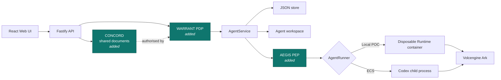

# Architecture

Volc Agent Launchpad is a single-node control plane for hackathon use.

> **This fork adds three middleware planes.** The baseline below is unchanged and
> still accurate; what sits on top of it is described in
> [MASTER.md](MASTER.md) (start here), [WARRANT_TRACK_B.md](WARRANT_TRACK_B.md)
> (the selected track), [CONCORD_SHARED_STATE.md](CONCORD_SHARED_STATE.md) and
> [MIDDLEWARE_ARCHITECTURE.md](MIDDLEWARE_ARCHITECTURE.md).



## Components

### Web UI

Lists Agents, manages lifecycle actions, submits prompts, and polls asynchronous
Runs. It never receives the Ark API key.

### Fastify API

Validates requests, protects remote demos with a shared bearer token, and
serves the compiled Web UI. The token is not user identity or authorization.

### AgentService

Coordinates lifecycle state, persistence, workspaces, and Runs. One Agent can
have only one active Run.

```text
ready -> busy -> ready
  |       |
  v       v
stopped  error
```

Interrupted Runs become `cancelled` after a restart.

### Storage

```text
data/launchpad.json       Agent, message, and Run metadata
workspaces/AgentID/       Agent-created files
workspaces/.deleted/      Archived deleted workspaces
codex-home/               Codex configuration and sessions
```

`JsonStore` serializes writes and atomically replaces one JSON file. It supports
one process only.

### Runtime providers

- `CodexRunner` runs Codex inside the application container for ECS.
- `ContainerCodexRunner` starts one disposable Docker, Colima, or Podman
  container for every local turn.

Both providers use argv-only process execution, bound output and time, resume
the stored Codex thread, and escalate termination after a grace period.

## Deployment profiles

| Profile | Control plane | Agent execution |
| --- | --- | --- |
| Local POC | Host Node.js | Disposable local container |
| ECS | Application container | Codex process in the same container |
| Local development | Host Node.js | Host Codex process |

## Extension seams — and what this fork did with them

| Track | Primary seam | Status in this repository |
| --- | --- | --- |
| Glass Box | `AgentRunner`, `AgentRun` | **Not attempted.** A hash-chained decision log exists because containment must be provable, not as a tracing product. |
| **Bouncer** | API routes, Agent ownership | **Built and selected.** `apps/server/src/warrant/` — see [WARRANT_TRACK_B.md](WARRANT_TRACK_B.md). |
| Kill Switch | `AgentRunner` | **Built, retained, not claimed.** `apps/server/src/aegis/` — see [MIDDLEWARE_ARCHITECTURE.md](MIDDLEWARE_ARCHITECTURE.md). |

Exactly one track is claimed, as the acceptance checklist requires: **B**.

### How the seams were used

- `RunnerRequest` gained an optional `inspect` hook, so AEGIS can evaluate the
  Codex event stream without either runner knowing about the middleware.
- `ContainerCodexRunner` gained a settable argv transform, applied at spawn time.
- `runner-factory.ts` is the entire integration point: without an `Aegis` it
  returns exactly the runner the starter kit shipped.
- New planes are additive modules; `AEGIS_ENABLED=false` restores the baseline.

The current container or ECS instance is the POC trust boundary. Ordinary
containers are not hardened multi-tenant isolation.
