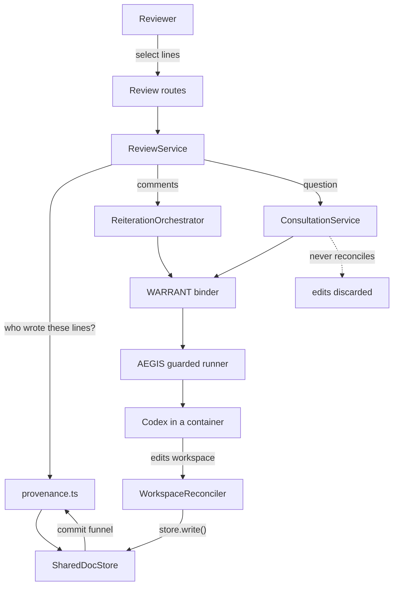

# CONCORD Review Loop

Provenance-routed human feedback for parallel Agents.

## The problem

CONCORD lets several Agents edit one document without losing each other's work.
What it could not answer is the question a reviewer actually asks: *who wrote
this line, and can I tell them it is wrong?* The history said "agent-7 changed
4 lines at v12" — a diff, not a conversation, and not addressable.

## What this adds

1. **Line provenance.** Every line of a shared document carries the Agent that
   last changed it.
2. **Agent-authored checkpoints.** An Agent names its own commit, so the log
   reads like a commit history rather than a change counter.
3. **Review comments.** A human selects lines and comments; the platform routes
   the comment to the Agent that wrote them.
4. **Consultation.** Ask that Agent to explain the code, without letting it
   change anything.
5. **Re-iteration.** Send comments back to the Agent; its revision returns
   through CONCORD's ordinary write path.

## Why this is middleware, not a feature

None of it is a UI affordance. Attribution is computed inside the write's
critical section, routing is a backend decision from that attribution, and the
Agent's revision is subject to the same merge, conflict and authorization rules
as any other write. A browser cannot claim a comment refers to code that was
never there, cannot aim feedback at an Agent that did not write the lines, and
cannot get a revision into shared state by any path that skips CONCORD.

## Architecture



The one asymmetry is deliberate: re-iteration goes through the reconciler,
consultation does not. That is what makes "explanation only" structural rather
than a request.

## Data model

| Type | Where | Persisted |
| --- | --- | --- |
| `LineProvenance` | on `SharedDoc.provenance` | with the document |
| `AgentContribution` | on `SharedDoc.contributions` | with the document |
| `ReviewComment` | `ReviewService` | `review-state.json` |
| `ReiterationRun` | `ReviewService` | `review-state.json` |
| `ReviewEvent` | `ReviewService` | `review-state.json` |
| `Consultation` | `ConsultationService` | in memory (see limitations) |

## The provenance algorithm

On every accepted write, inside the same critical section that commits content:

1. Capture the previous content and its provenance.
2. Diff old against new with CONCORD's existing `diffLines` — no new dependency.
3. Lines outside any hunk keep their `lineId` and their previous attribution.
4. Deleted lines drop their provenance; it is never shifted onto a neighbour,
   which would misroute a comment.
5. Inserted or replaced lines get fresh ids attributed to the writing Agent.
6. Record one `AgentContribution` with the changed line ids.

Invariant, enforced with a throw: `provenance.length === lines(content).length`.
A misaligned array is how a comment reaches the wrong Agent, so it fails loudly.

Seeded and human-authored content is attributed to `null` — nobody. That is a
statement, not a gap: this is *last modifier*, not authorship or ownership.

Human conflict resolution runs the same reconciliation, attributing the settled
lines to the human who settled them.

## Comment anchoring

`selectedText` and its SHA-256 are derived on the server from canonical content
at creation, along with `baseVersion`. Anything the caller sends for those
fields is ignored.

Before an Agent is asked to act, the anchor is re-checked. If the lines no
longer hash to what the comment was written against, the comment is marked
`stale` and held. It is not relocated — guessing a new location would send an
Agent feedback about code that no longer exists.

## Responsible-Agent resolution

- Exactly one Agent in range → recommended.
- Several → **ambiguous**; the reviewer must choose. The platform does not pick.
- None → the reviewer must name one.

An explicit choice must still be an Agent that wrote some of the range,
otherwise feedback could be aimed anywhere.

## WARRANT and AEGIS integration

- The reviewer is resolved from the session token only (`plane.whoami`). A human
  never names itself in a body.
- Comment listing, routing and blame are gated on the same `readHistory`
  authorization that guards document history. The store's provenance readers are
  ungated for internal callers, so the gate lives at the route.
- Re-iteration and consultation both bind through `plane.binder.bind`, so a
  revoked or expired warrant refuses the run before it starts.
- Execution goes through the existing runner, so AEGIS remains in the path. No
  second model client exists.

**One thing WARRANT does not model:** its PDP answers agent→resource, not "may
this human instruct this Agent?" Ownership of the comment is used instead — a
reviewer may only dispatch and resolve their own comments. A proper
human→agent action would be a WARRANT change and is deliberately not made here.

## Parallelism

Comments for different Agents become separate runs, launched together, so those
Agents proceed concurrently. An Agent already running is refused with 409 rather
than queued: one concurrent run per Agent is a hard constraint of both runners.

The check and the claim happen in the same synchronous step. Claiming after an
await left a window where two runs both passed the check — found by a test.

## Outcomes

CONCORD's own outcome is reported unchanged:

| CONCORD | Run | Comments become |
| --- | --- | --- |
| `written` / `merged` | same | `addressed` |
| `conflict` | `conflict` | `conflict`, canonical kept |
| `denied` | `denied` | stay `open` |
| `leased` | `leased` | stay `open` |
| unchanged | `no_change` | stay `open` |

Comments become **addressed**, never **resolved**. An Agent producing a patch is
not a human agreeing the point was handled. Only a human resolves.

## Context retrieval, and why there is no vector database

For a comment on a line range the file and the lines are already known. There is
nothing to search for. Retrieval is the selected range, a bounded window either
side, and the whole document when it fits under 40 KB. Comments are delimited
and labelled as untrusted review data, and the platform rules are stated before
them.

An embedding index would add a dependency, an indexing job and a staleness
problem in exchange for a lookup we can already do exactly.

## API

| Method | Route | Purpose |
| --- | --- | --- |
| GET | `/api/concord/docs/:docId/blame` | Per-line attribution |
| GET | `/api/concord/docs/:docId/contributions` | Agent-authored commit log |
| GET | `/api/review/docs/:docId/route` | Who owns a line range |
| GET | `/api/review/docs/:docId/comments` | Comments, runs, events |
| POST | `/api/review/docs/:docId/comments` | Create a comment |
| POST | `/api/review/comments/:id/resolve` | Human resolves |
| POST | `/api/review/reiterations` | Send comments to their Agents |
| POST | `/api/review/consultations` | Ask, without changing anything |
| GET | `/api/review/consultations/:id` | One consultation |

## Scenarios

**Normal.** Agent A commits at v2 with "clarify the error". A reviewer selects
that line; the platform routes to A. They comment and re-iterate. A's revision
returns through `store.write()` as `written` at v3, the comment becomes
`addressed`, and blame shows the line as A's at v3.

**Conflict.** Two Agents commit to one file from the same base. Disjoint edits
merge and both attributions survive. Overlapping edits produce a conflict:
canonical content is untouched, provenance is untouched, no contribution is
recorded, and the losing text is held for a human.

**Hostile consultation.** An Agent asked to explain code rewrites the file
instead. Nothing reaches CONCORD — the path never reconciles — the workspace is
re-materialized from the committed version, and the document version is
re-checked. Covered by a test at the HTTP boundary.

## Verified vs not

**Deterministically verified** (358 tests overall, including 10 over real HTTP with the
real WARRANT PDP and CONCORD store): provenance reconciliation and its
invariant; attribution across merges; blame gating; checkpoint parsing and its
arrival in the log; server-derived anchors; staleness holding; ambiguity
refusal; comment ownership; re-iteration landing through CONCORD; consultation
leaving canonical state untouched under a hostile Agent; review state surviving
a restart.

**Not verified:** a live Ark model actually revising code or answering a
consultation. Codex is stubbed in every test. The UI compiles and builds but has
not been reviewed in a browser.

## Limitations

- Consultations are in memory; comments, runs and events persist.
- Whole-document writes. Two Agents on the same lines still conflict by design.
- Blame is last-modifier only. It is not authorship and not ownership.
- A stale comment is held, never relocated.
- No comment threads and no replies. One comment, one body.
- `ReviewService` is single-process, like `SharedDocStore`.

## Commands

```bash
npm install
npm run check     # typecheck + 358 tests + build
npx vitest run src/review --root apps/server        # the review loop
npx vitest run src/concord --root apps/server       # provenance and blame
```
