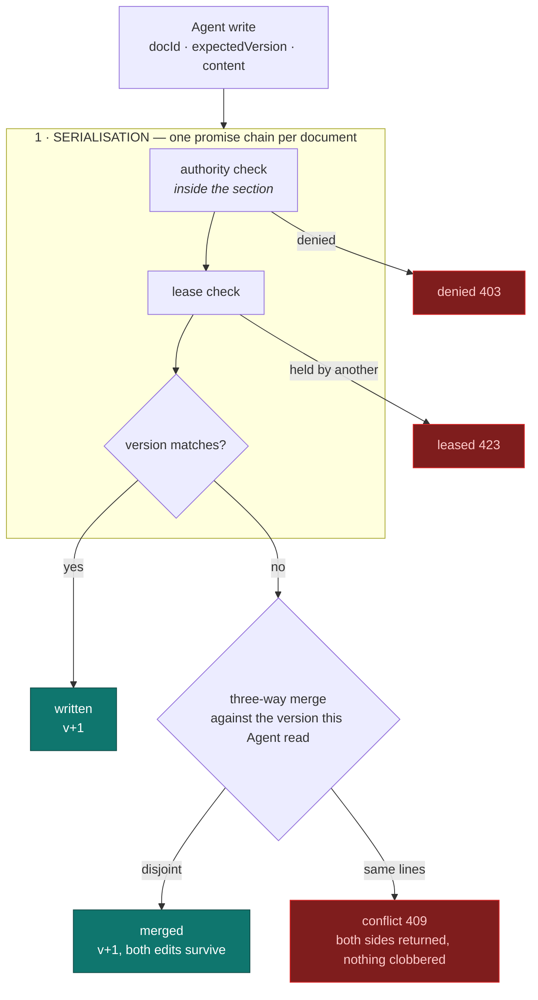

# CONCORD — shared concurrent state for many Agents

**Companion to [`WARRANT_TRACK_B.md`](WARRANT_TRACK_B.md).** WARRANT decides *who may
touch what*. CONCORD decides *what happens when several of them touch it at once*.

> **One sentence.** Many Agents edit one shared document concurrently, and no edit is ever
> silently lost: writes on a document are serialised, a stale write is rebased by three-way
> merge rather than rejected or clobbered, and a genuine same-line disagreement is reported
> instead of resolved by whoever happened to arrive last.

---

## 1. Why static partitioning was not enough

The first version of the fan-out avoided conflicts by *forbidding* them: the splitter gave
each subtask a disjoint set of files, and a warrant covered only those files. That works
until two subtasks genuinely need the same file — a changelog, a shared spec, a route index,
a table of contents. Real work has those, and "you may not both edit the changelog" is not a
usable answer.

So shared files are now explicit. `sharedPaths` on a plan grants a document to **every**
subtask's warrant, deliberately outside the partition — and CONCORD is what makes that safe.

## 2. The two races

| Race | What it looks like | Closed by |
| --- | --- | --- |
| **Lost update** | Two Agents read v3. Both write. One silently overwrites the other, no error is raised, and the work is simply gone. | Serialisation + CAS + merge |
| **Stale authority (TOCTOU)** | An Agent's warrant is revoked *between* the authorization check and the write. The write lands anyway. | Authority checked **inside** the critical section |

The second is the interesting one, and it is why CONCORD and WARRANT could not be built as
two independent layers. If the route checks authority and *then* calls the store, there is a
window. The store therefore calls the PDP itself, inside the same critical section as the
write:

```ts
write(docId, agentId, expectedVersion, content) {
  return this.serialize(docId, () => {
    // Inside the critical section. A revocation that landed while the Agent
    // was thinking is honoured here, not raced.
    const verdict = this.authorize(agentId, "workspace.write", docResource(docId));
    if (!verdict.allowed) return { status: "denied", ... };
    ...
  });
}
```

## 3. Three mechanisms, in order of how much they are trusted



**1 · Serialisation** is the actual guarantee. Every operation on one document runs in a
promise chain, so two operations on the same document never interleave. Different documents
do not block each other — the chain is per document, not global.

**2 · Optimistic CAS with merge.** A write states the version it read. If the document has
moved on, the write is *not* rejected: CONCORD merges the Agent's edit against the version
that Agent actually read. Only a genuine same-line disagreement becomes a conflict.

**3 · Leases** give exclusive access for a multi-step edit, with a TTL so a dead Agent
cannot hold a document forever.

### Outcomes

| Outcome | HTTP | Meaning |
| --- | ---: | --- |
| `written` | 200 | Version matched; committed. |
| `merged` | 200 | Version had moved; edits were disjoint; both survive. |
| `conflict` | 409 | Same lines. Both sides returned; committed content untouched. |
| `denied` | 403 | The warrant does not cover this document, or was revoked. |
| `leased` | 423 | Another Agent holds an exclusive lease. |

Distinct codes on purpose: a client must be able to tell *"you may not"* from *"someone got
there first"* from *"rebase and retry"*. Collapsing them into 500 makes an Agent retry the
one thing that will never succeed.

## 4. Why line-based merge, not a CRDT

Google Docs uses OT/CRDT because humans type *characters* concurrently, and per-character
metadata is worth its cost. **Agents rewrite whole lines.** A CRDT would carry significant
per-character bookkeeping to solve a problem this workload does not have.

The honest trade: a line-based merge cannot resolve two edits to the *same* line, so it
reports a conflict where a CRDT would converge on something. Converging on something is not
obviously better — for code, an automatically merged line neither author wrote is worse than
being told to look. See §6 for when this stops being the right call.

## 5. Evidence

`npm run demo:warrant`, beat 6 — two Agents writing the same document simultaneously:

```
── 6  SHARED STATE — both agents edit one document, no race
   both agents hold version 1 of docs/CHANGELOG.md
   alice -> written     bob -> merged  (concurrent, disjoint lines)
     # Changelog
     - rate limiter (alice)
     - TBD
     - config validation (bob)
   Both edits survived. Serialised writes, three-way merge, no lost update.
   same line -> conflict   reported, not silently resolved
```

### Tests — 36 across two files

| Property | Test |
| --- | --- |
| 20 concurrent writers, nothing lost | every write is `written`, `merged` or `conflict`; versions dense and unique |
| Concurrent disjoint edits all survive | version advances once per commit; every Agent's text present |
| Blind write (no prior read) conflicts | it cannot be rebased, so refusing is the safe outcome |
| Same-line edits conflict | both sides returned; committed content unchanged |
| Authority inside the section | revoke between read and write ⇒ `denied`, document untouched |
| Lease exclusivity and expiry | second writer `leased`; a dead holder's lease expires |
| Per-document, not global, serialisation | two documents commit in parallel |
| `sharedPaths` over HTTP | regression: the route schema had stripped it |
| Listing is scoped to the caller | an Agent sees only documents its warrant covers |
| History is gated like content | it names the Agent and human per version, so it is read authority, not public metadata |
| Denied before missing | a caller without authority cannot probe which documents exist |
| Release needs authority | naming the holder no longer strips someone else's lease; the lease survives |

> The `sharedPaths` row is worth flagging. It reached the orchestrator in unit tests but
> was silently dropped by the route's Zod schema, so every shared write was denied over
> HTTP. The unit tests passed because they called the orchestrator directly. **The demo
> caught it, not the suite** — an argument for keeping an end-to-end path that exercises the
> real boundary.

## 6. Limitations

| # | Limitation | Why | Next |
| --- | --- | --- | --- |
| **C1** | In-memory. Documents do not survive a restart. | Matches the baseline `JsonStore`. | Persist alongside the workspace, or Postgres. |
| **C2** | Single process. Serialisation is a promise chain, so it holds within one Node process only. | The starter kit is single-process. | Postgres row locks or Redis leases for multi-instance. |
| **C3** | Merge is O(n·m) in lines. | LCS table; fine for source files. | Patience or histogram diff for large documents. |
| **C4** | Same-line edits always conflict. | Deliberate — see §4. | Per-character CRDT *if* real-time human co-editing is ever added. |
| **C5** | No conflict *resolution* UI. Conflicts are reported over the API, not resolved anywhere. | Out of time. | Show both sides and let the owning human choose. |
| **C7** | Concurrency *outcomes* (`merged`, `conflict`, `leased`) are not appended to the audit chain - only the authority decision behind them is. | The chain records authorization, and that is what Track B requires. | Append the outcome too, so "both edits survived" is chain evidence rather than an API response. |
| **C6** | Agents do not yet write through CONCORD automatically. The store is driven by the API and the demo; the Codex runtime still writes to its own workspace. | The runtime seam is separate work. | Route agent file writes through the store. |

**C6 is the biggest gap** — say it plainly if asked. CONCORD is a working, tested
concurrency-control middleware with a real HTTP surface, but the sandboxed Codex process
does not yet route its file writes through it.

---

<sub>CONCORD · shared concurrent state · companion to WARRANT (Track B)</sub>
