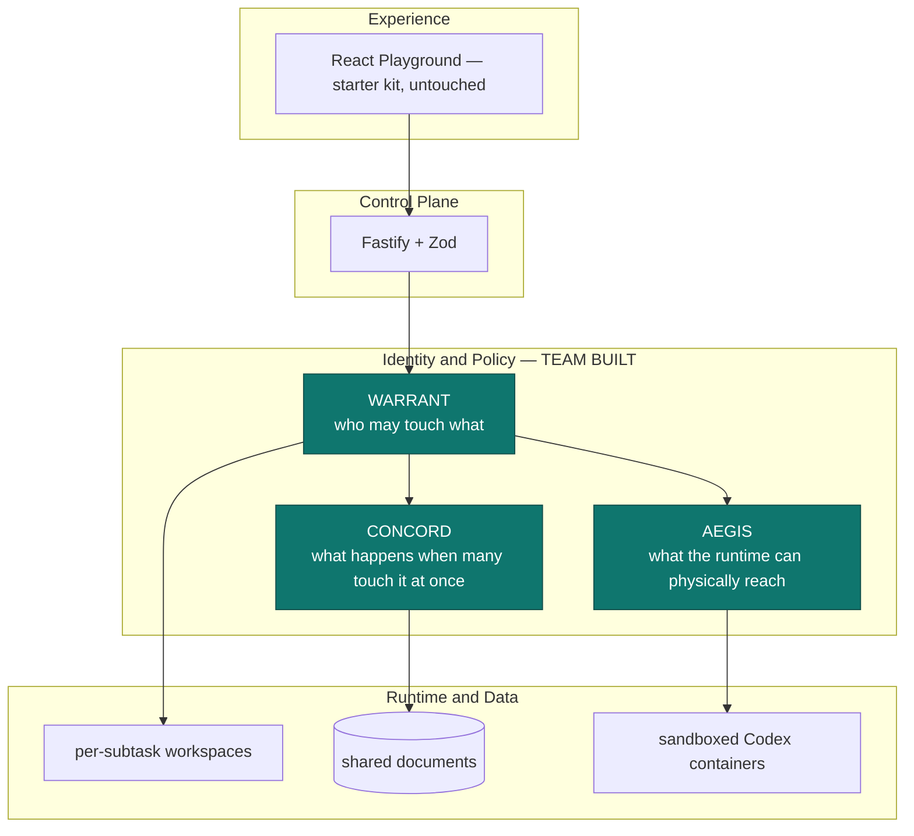

# MASTER — team reference

**Read this first. Update it when anything changes.**
This is the single page the whole team works from. Every other document is detail hanging
off this one.

| | |
| --- | --- |
| **Challenge** | CodeJam Track #5 v2 — Agent Middleware, 3 days |
| **Starter kit** | Volc Agent Launchpad (React + Fastify + Codex CLI + Volcengine Ark) |
| **Our selected track** | **B — The Bouncer (Identity and Authorization)** |
| **Also present, not claimed** | C — Kill Switch (sandboxing) |
| **Repo** | `github.com/zektron001/PleaseHireMe` |
| **Verify everything** | `npm run check` → typecheck + **202 tests** + build |
| **See the story** | `npm run demo:warrant` → 10 beats, ~2s, no Ark key needed |
| **Last updated** | 2026-08-30 — see the changelog at the bottom |

---

## 1. The idea, in one page

**The problem we picked.** One big task — a GitHub issue, a document, a feature — is split
into subtasks. Each subtask gets its own Agent. Each Agent is accountable to **one human**:
the person who would otherwise have done that subtask. Every Agent works in its own isolated
environment so they cannot trip over each other. An orchestrator splits the work, assigns
the model, and combines the results at the end.

**What makes it middleware rather than an app.** Fan-out creates an authorization problem
that the starter kit cannot express:

- Agent-for-Alice must never reach Bob's work.
- The orchestrator must not merge work whose owner has not approved it.
- A human must be able to pull an Agent's authority *mid-flight*.
- When several Agents legitimately share one file, nobody's edit may be silently lost.

That is the product. The task splitting is scaffolding that creates the situation.

### How the original idea maps to what exists

| What we said in the pitch | What it became | Judged? |
| --- | --- | --- |
| Split one big task into subtasks | `orchestrator.plan()` + Ark splitter | scaffolding |
| Assign a human to control each Agent | **WARRANT** — the delegation plane | **yes — this is the track** |
| Isolate each Agent's environment | Per-subtask workspaces + `WB-6` + no sibling mount | **yes** |
| Prevent merge conflicts | **CONCORD** — serialised writes + three-way merge | supporting |
| Orchestrator checks and combines | Integration gate `WB-7` / `WB-8` | **yes** |
| Orchestrator picks the model per task | `model-policy.ts` tier routing | scaffolding |

> **One deliberate change from the original pitch.** Our orchestrator holds **no** workspace
> authority. A "daddy agent" that can read every workspace becomes the single principal an
> attacker needs — the classic confused deputy. It can split, assign and integrate, and
> nothing else.

### Rules from the brief that constrain us

- **Exactly one track** must be named in the README (§7 acceptance checklist). We name B.
- Workflow editors are **out of scope** (§8) — so the orchestrator stays thin on purpose.
- The application domain is **not judged** (§6). Mock data is explicitly fine (§8).
- Middleware must run in a **real backend path**, not the UI (§7).
- A narrow feature that works end to end beats three incomplete ideas (§1).

---

## 2. The three planes



| Plane | Answers | Module | Docs |
| --- | --- | --- | --- |
| **WARRANT** | *Who may touch what?* | `apps/server/src/warrant/` | [WARRANT_TRACK_B.md](WARRANT_TRACK_B.md) |
| **CONCORD** | *What if many touch it at once?* | `apps/server/src/concord/` | [CONCORD_SHARED_STATE.md](CONCORD_SHARED_STATE.md) |
| **AEGIS** | *What can the runtime physically reach?* | `apps/server/src/aegis/` | [MIDDLEWARE_ARCHITECTURE.md](MIDDLEWARE_ARCHITECTURE.md) |

**The idea that ties them together:** a *warrant* is a scoped, expiring, revocable grant from
one human to one Agent. WARRANT issues and checks it. CONCORD consults it **inside** the
write's critical section, so a revocation that lands mid-edit is honoured rather than raced.
AEGIS turns it into a mount set, so a denial is physical as well as logical.

---

## 3. Who owns what

Five people. Update your name into the table on Day 1.

| Area | People | Owner (fill in) | Module | Primary doc |
| --- | ---: | --- | --- | --- |
| **CONCORD** — shared state, "the Google Docs part" | **3** | `@___`, `@___`, `@___` | `src/concord/` | [CONCORD_SHARED_STATE.md](CONCORD_SHARED_STATE.md) |
| **AEGIS** — sandboxing | **2** | `@___`, `@___` | `src/aegis/` | [MIDDLEWARE_ARCHITECTURE.md](MIDDLEWARE_ARCHITECTURE.md) |
| **WARRANT** — delegation (already built) | shared | everyone reviews | `src/warrant/` | [WARRANT_TRACK_B.md](WARRANT_TRACK_B.md) |

### Suggested split *within* CONCORD (3 people)

So three people are not editing `store.ts` at once — which would be ironic:

| # | Slice | Files | Depends on |
| --- | --- | --- | --- |
| **C-a** | Conflict resolution UI + the evidence panel | `apps/web/src/`, read-only on the API | the existing API |
| **C-b** | Persistence + agent write-through (**C6**) | `concord/store.ts` persistence, runtime seam | nothing |
| **C-c** | Merge quality + presence/"who is editing" | `concord/merge.ts`, new presence endpoints | nothing |

### Suggested split *within* AEGIS (2 people)

| # | Slice | Files | Depends on |
| --- | --- | --- | --- |
| **A-a** | Egress broker (**RR-2**) — the biggest gap | `aegis/egress/broker.ts` (new), `sandbox/args.ts` | Docker up |
| **A-b** | Live container run + evidence (**RR-3**) | runtime image, `demo`, docs | Docker + runtime image |

---

## 4. ROADMAP — everyone updates this

> ### How to update — please actually do this
>
> 1. **When you start an item:** set Status to `WIP`, put your handle in Owner, set Updated
>    to today's date.
> 2. **When you finish:** set Status to `DONE` and add the test count or evidence in Notes.
> 3. **If you are blocked:** set Status to `BLOCKED` and say what by, in Notes.
> 4. **Add a line to the changelog** at the bottom of this file. One line. Newest first.
> 5. **Do not delete rows.** A `DROPPED` row with a reason is information; a missing row is
>    a mystery on Day 3.
>
> Statuses: `TODO` · `WIP` · `BLOCKED` · `DONE` · `DROPPED`
>
> Commit roadmap edits on their own, with the message `docs: roadmap <area> <status>`. That
> keeps them trivial to merge when five people edit this table on the same day.

### Done — do not redo

| ID | Item | Area | Evidence |
| --- | --- | --- | --- |
| D1 | Delegation model: warrants, scopes, expiry, revocation | WARRANT | 21 tests |
| D2 | Cross-owner denial `WB-6`, backend-enforced | WARRANT | 16 tests, HTTP-level |
| D3 | Forged-identity success test | WARRANT | attacks query + 2 headers + body |
| D4 | Integration gate `WB-7`/`WB-8` | WARRANT | orchestrator holds no workspace authority |
| D5 | Physical workspace isolation | WARRANT + AEGIS | 13 tests over generated argv |
| D6 | Hash-chained decision log with the five-tuple | all | tamper located by index |
| D7 | Trace access control, capture levels, retention | AEGIS | was an open hole; now session-gated + scoped |
| D8 | Budget ledger, max steps, concurrency, kill switch | AEGIS | reserve-then-settle |
| D9 | Shared documents: serialised writes, 3-way merge, leases | CONCORD | 29 tests |
| D10 | Threat model against all seven brief threats | docs | [THREAT_MODEL.md](THREAT_MODEL.md) |

### Open — claim a row

| ID | Item | Area | Owner | Status | Updated | Notes |
| --- | --- | --- | --- | --- | --- | --- |
| **R1** | **Egress broker** — makes network confinement topological, not just detective | AEGIS | `@___` | `TODO` | — | RR-2. Highest-value gap. `hardenContainerArgs` already emits the flags. |
| **R2** | **Live container run** under the hardened profile | AEGIS | `@___` | `TODO` | — | RR-3. Turns "argv says unreachable" into "we tried it and it failed". |
| **R3** | **Agents write through CONCORD** instead of straight to their workspace | CONCORD | `@___` | `TODO` | — | C6. Biggest CONCORD gap; currently API + demo only. |
| **R4** | **Conflict resolution UI** — show both sides, owner picks | CONCORD | `@___` | `TODO` | — | C5. Also gives the demo something visual. |
| **R5** | **Persist CONCORD documents** across restart | CONCORD | `@___` | `TODO` | — | C1. |
| **R6** | **Presence** — which Agent is editing what, right now | CONCORD | `@___` | `TODO` | — | Optional. Strong "Google Docs" feel for the demo. |
| **R7** | **Evidence panel in the Web UI** | any | `@___` | `TODO` | — | Judges must *see* something; terminal demo covers it, UI covers it better. |
| **R8** | **Run the Ark splitter once against a live endpoint** | any | `@___` | `TODO` | — | L6. Parsing and fallback are tested; the network call is not. |
| **R9** | **Rehearse the 3-minute demo end to end** | everyone | `@___` | `TODO` | — | Day 3. Must land under 3:00. |
| **R10** | **Real auth for humans (OIDC)** | WARRANT | `@___` | `TODO` | — | RR-1 / L1. *Probably out of scope for 3 days — decide by Day 2.* |

### Priority if time runs short

**R9 > R7 > R3 > R1 > R2.** A rehearsed demo with a visible panel beats one more control
that nobody sees. R10 is almost certainly not worth it — mock users are explicitly allowed.

---

## 5. How to run and verify

```bash
npm install

# Everything: typecheck + 202 tests + build. This must stay green.
npm run check

# The Track B story in the terminal — no Ark key, no Docker needed.
npm run demo:warrant

# The full local POC (needs Docker/Colima/Podman + an Ark key).
ARK_API_KEY=... ARK_MODEL=ep-... npm run poc
```

**Turn the middleware off** to prove the baseline still works: `AEGIS_ENABLED=false`.

### What the demo shows, beat by beat

| Beat | Shows |
| ---: | --- |
| 1–2 | Three humans sign in; one task fans out to 3 subtasks, each with owner + agent + warrant + model |
| 3 | **Positive** — an Agent works inside its own warrant |
| 4 | **Denial** — the same Agent reaches for Bob's workspace, `WB-6` |
| 5 | **Physical** — Bob's directory is bound at no path in Alice's container |
| 6 | **Shared state** — both Agents edit one document at once; both edits survive; same-line conflicts are reported |
| 7 | **Success test** — forging the user id four ways changes nothing |
| 8 | **Integration gate** — orchestrator blocked until every owner approves |
| 9 | **Revocation** — an owner pulls authority; the next action is refused |
| 10 | **Evidence** — every decision in one verifiable hash chain |

---

## 6. Document index

| Document | What it is | Who should read it |
| --- | --- | --- |
| **MASTER.md** (this file) | The single reference + roadmap | everyone, daily |
| [WARRANT_TRACK_B.md](WARRANT_TRACK_B.md) | The judged track: delegation and authorization | everyone |
| [CONCORD_SHARED_STATE.md](CONCORD_SHARED_STATE.md) | Shared concurrent state, races, merge | the CONCORD 3 |
| [MIDDLEWARE_ARCHITECTURE.md](MIDDLEWARE_ARCHITECTURE.md) | AEGIS: layered architecture, gates, formal policy | the AEGIS 2 |
| [THREAT_MODEL.md](THREAT_MODEL.md) | All seven threats, honest implemented/partial/not-built | everyone before the demo |
| [ARCHITECTURE.md](ARCHITECTURE.md) | Starter-kit architecture *(original, not yet updated)* | reference |
| [LOCAL_POC.md](LOCAL_POC.md) · [DEPLOYMENT.md](DEPLOYMENT.md) | Running and deploying *(original)* | whoever runs the POC |
| [HACKATHON_EXTENSION_GUIDE.md](HACKATHON_EXTENSION_GUIDE.md) | The organizers' brief | everyone, once |
| `hackathon-v2-section-*.xml` | The raw challenge spec | when arguing about rules |

---

## 7. Working agreements

Fitting, given what we are building:

1. **One person per module at a time.** If two of you must touch `store.ts`, say so in the
   team chat first. We built a whole middleware about this problem; let us not demonstrate it
   on ourselves.
2. **`npm run check` must be green before you push.** 202 tests. If you break one, fix it or
   revert — do not leave it red for someone else to find at 2am.
3. **Every new control needs a positive *and* a negative test.** The negative one is the
   point. "It allows the good case" proves nothing about a security control.
4. **Do not overclaim in docs.** Every doc here marks what is *not* built. Keep that habit —
   a judge who catches one overstatement discounts everything else you said.
5. **Small commits, conventional messages.** `feat(concord): ...`, `fix(aegis): ...`,
   `docs: ...`, `test: ...`.
6. **Branch per person off `main`.** Do not commit to `main` directly.

---

## 8. Glossary

| Term | Means |
| --- | --- |
| **Warrant** | A scoped, expiring, revocable grant from one human to one Agent, over an explicit resource set. The only source of Agent authority. |
| **Principal** | An actor. Human (`human:alice`) or Agent (derived from a warrant, always narrower). |
| **PDP / PEP** | Policy Decision Point (decides, pure) / Enforcement Point (acts). Standard access-control split. |
| **Five-tuple** | human · agent · action · resource · decision. What Track B requires on every record. |
| **`WB-*`** | A WARRANT rule id. `WB-6` is the cross-owner denial. |
| **`KS-*`** | An AEGIS control id. `KS-1` egress, `KS-2` vault, `KS-5` attestation. |
| **CAS** | Compare-and-swap. A write states the version it read; a mismatch is a conflict, not an overwrite. |
| **TOCTOU** | Time-of-check to time-of-use. The window between checking authority and using it. |
| **Confused deputy** | A privileged component tricked into acting for someone who lacks the privilege. Why our orchestrator holds no workspace authority. |

---

## 9. Changelog — newest first, one line each

> Add a line whenever you change the roadmap or land something significant.
> Format: `YYYY-MM-DD · @handle · what changed`

- `2026-08-30` · `@jemy` · CONCORD shared state added (29 tests); MASTER.md created; roadmap opened for claiming.
- `2026-08-30` · `@jemy` · Threat model written against all seven brief threats; trace access control hole found and closed.
- `2026-08-30` · `@jemy` · Physical workspace isolation landed (L2 closed, 13 tests).
- `2026-08-29` · `@jemy` · Track switched to **B (Bouncer)**; WARRANT delegation plane built; AEGIS retained but not claimed.
- `2026-08-29` · `@jemy` · AEGIS (Track C) built against the starter kit.

---

<sub>Keep this file honest. If it says `DONE` and it is not, we will find out in front of judges.</sub>
