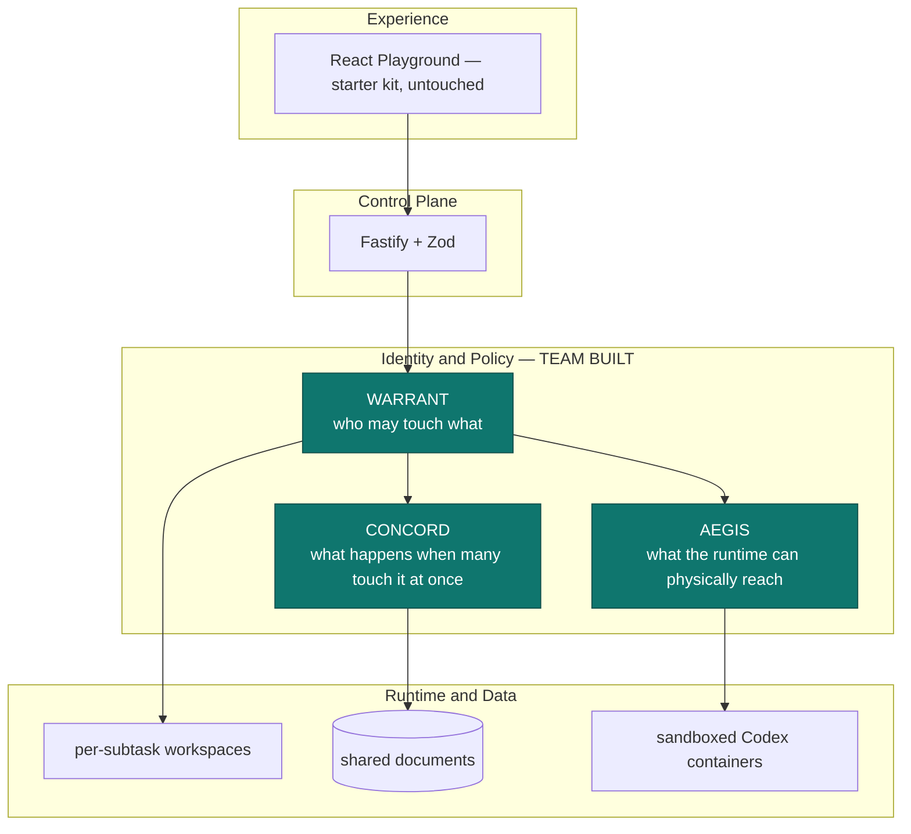

# MASTER — team reference

**Read this first. Update it when anything changes.**
This is the single page the whole team works from. Every other document is detail hanging
off this one.

| | |
| --- | --- |
| **Challenge** | CodeJam Track #5 v2 — Agent Middleware, 3 days |
| **Starter kit** | Volc Agent Launchpad (React + Fastify + Codex CLI + Volcengine Ark) |
| **Our selected track** | **B — The Bouncer (Identity and Authorization)** |
| **Also present, not claimed** | C — Kill Switch (sandboxing) |
| **Repo** | `github.com/zektron001/PleaseHireMe` |
| **Verify everything** | `npm run check` → typecheck + **403 tests** + build |
| **See the story** | `npm run demo:warrant` → 10 beats, ~2s, no Ark key needed |
| **See it in a browser** | sidebar → **Middleware console** |
| **Last updated** | 2026-08-30 — see the changelog at the bottom |

---

## 1. The idea, in one page

**The problem we picked.** One big task — a GitHub issue, a document, a feature — is split
into subtasks. Each subtask gets its own Agent. Each Agent is accountable to **one human**:
the person who would otherwise have done that subtask. Every Agent works in its own isolated
environment so they cannot trip over each other. An orchestrator splits the work, assigns
the model, and combines the results at the end.

**What makes it middleware rather than an app.** Fan-out creates an authorization problem
that the starter kit cannot express:

- Agent-for-Alice must never reach Bob's work.
- The orchestrator must not merge work whose owner has not approved it.
- A human must be able to pull an Agent's authority *mid-flight*.
- When several Agents legitimately share one file, nobody's edit may be silently lost.

That is the product. The task splitting is scaffolding that creates the situation.

### How the original idea maps to what exists

| What we said in the pitch | What it became | Judged? |
| --- | --- | --- |
| Split one big task into subtasks | `orchestrator.plan()` + Ark splitter | scaffolding |
| Assign a human to control each Agent | **WARRANT** — the delegation plane | **yes — this is the track** |
| Isolate each Agent's environment | Per-subtask workspaces + `WB-6` + no sibling mount | **yes** |
| Prevent merge conflicts | **CONCORD** — serialised writes + three-way merge | supporting |
| Orchestrator checks and combines | Integration gate `WB-7` / `WB-8` | **yes** |
| Orchestrator picks the model per task | `model-policy.ts` tier routing | scaffolding |

> **One deliberate change from the original pitch.** Our orchestrator holds **no** workspace
> authority. A "daddy agent" that can read every workspace becomes the single principal an
> attacker needs — the classic confused deputy. It can split, assign and integrate, and
> nothing else.

### Rules from the brief that constrain us

- **Exactly one track** must be named in the README (§7 acceptance checklist). We name B.
- Workflow editors are **out of scope** (§8) — so the orchestrator stays thin on purpose.
- The application domain is **not judged** (§6). Mock data is explicitly fine (§8).
- Middleware must run in a **real backend path**, not the UI (§7).
- A narrow feature that works end to end beats three incomplete ideas (§1).

---

## 2. The three planes



| Plane | Answers | Module | Docs |
| --- | --- | --- | --- |
| **WARRANT** | *Who may touch what?* | `apps/server/src/warrant/` | [WARRANT_TRACK_B.md](WARRANT_TRACK_B.md) |
| **CONCORD** | *What if many touch it at once?* | `apps/server/src/concord/` | [CONCORD_SHARED_STATE.md](CONCORD_SHARED_STATE.md) |
| **AEGIS** | *What can the runtime physically reach?* | `apps/server/src/aegis/` | [MIDDLEWARE_ARCHITECTURE.md](MIDDLEWARE_ARCHITECTURE.md) |

**The idea that ties them together:** a *warrant* is a scoped, expiring, revocable grant from
one human to one Agent. WARRANT issues and checks it. CONCORD consults it **inside** the
write's critical section, so a revocation that lands mid-edit is honoured rather than raced.
AEGIS turns it into a mount set, so a denial is physical as well as logical.

---

## 3. Who owns what

Five people. Update your name into the table on Day 1.

| Area | People | Owner (fill in) | Module | Primary doc |
| --- | ---: | --- | --- | --- |
| **CONCORD** — shared state, "the Google Docs part" | **3** | `@___`, `@___`, `@___` | `src/concord/` | [CONCORD_SHARED_STATE.md](CONCORD_SHARED_STATE.md) |
| **AEGIS** — sandboxing | **2** | `@___`, `@___` | `src/aegis/` | [MIDDLEWARE_ARCHITECTURE.md](MIDDLEWARE_ARCHITECTURE.md) |
| **WARRANT** — delegation (already built) | shared | everyone reviews | `src/warrant/` | [WARRANT_TRACK_B.md](WARRANT_TRACK_B.md) |

### Suggested split *within* CONCORD (3 people)

So three people are not editing `store.ts` at once — which would be ironic:

| # | Slice | Files | Depends on |
| --- | --- | --- | --- |
| **C-a** | Conflict resolution UI + the evidence panel | `apps/web/src/`, read-only on the API | the existing API |
| **C-b** | Persistence + agent write-through (**C6**) | `concord/store.ts` persistence, runtime seam | nothing |
| **C-c** | Merge quality + presence/"who is editing" | `concord/merge.ts`, new presence endpoints | nothing |

### Suggested split *within* AEGIS (2 people)

| # | Slice | Files | Depends on |
| --- | --- | --- | --- |
| **A-a** | Egress broker (**RR-2**) — the biggest gap | `aegis/egress/broker.ts` (new), `sandbox/args.ts` | Docker up |
| **A-b** | Live container run + evidence (**RR-3**) | runtime image, `demo`, docs | Docker + runtime image |

---

## 4. ROADMAP — everyone updates this

> ### How to update — please actually do this
>
> 1. **When you start an item:** set Status to `WIP`, put your handle in Owner, set Updated
>    to today's date.
> 2. **When you finish:** set Status to `DONE` and add the test count or evidence in Notes.
> 3. **If you are blocked:** set Status to `BLOCKED` and say what by, in Notes.
> 4. **Add a line to the changelog** at the bottom of this file. One line. Newest first.
> 5. **Do not delete rows.** A `DROPPED` row with a reason is information; a missing row is
>    a mystery on Day 3.
>
> Statuses: `TODO` · `WIP` · `BLOCKED` · `DONE` · `DROPPED`
>
> Commit roadmap edits on their own, with the message `docs: roadmap <area> <status>`. That
> keeps them trivial to merge when five people edit this table on the same day.

### Done — do not redo

| ID | Item | Area | Evidence |
| --- | --- | --- | --- |
| D1 | Delegation model: warrants, scopes, expiry, revocation | WARRANT | 21 tests |
| D2 | Cross-owner denial `WB-6`, backend-enforced | WARRANT | 16 tests, HTTP-level |
| D3 | Forged-identity success test | WARRANT | attacks query + 2 headers + body |
| D4 | Integration gate `WB-7`/`WB-8` | WARRANT | orchestrator holds no workspace authority |
| D5 | Physical workspace isolation | WARRANT + AEGIS | 13 tests over generated argv |
| D6 | Hash-chained decision log with the five-tuple | all | tamper located by index |
| D7 | Trace access control, capture levels, retention | AEGIS | was an open hole; now session-gated + scoped |
| D8 | Budget ledger, max steps, concurrency, kill switch | AEGIS | reserve-then-settle |
| D9 | Shared documents: serialised writes, 3-way merge, leases | CONCORD | 29 tests |
| D10 | Threat model against all seven brief threats | docs | [THREAT_MODEL.md](THREAT_MODEL.md) |
| D11 | CONCORD read/release paths gated by the warrant | CONCORD | 7 tests; listing scoped, history gated, lease release authorised |
| D12 | Documents persist; presence; conflict resolution; agent write-through | CONCORD | 31 tests; R3/R4/R5/R6 below |
| D13 | Middleware console in the browser | web | R7; sidebar → Middleware console |
| D14 | Concurrency outcomes in the audit chain (`C.concord`) | CONCORD | C7 closed |
| D15 | Line provenance + Agent-authored checkpoint commits | CONCORD | 29 tests; blame and a commit log per document |
| D16 | Review loop: comment, consult, re-iterate, resolve | CONCORD | 35 tests incl. 10 over real HTTP |
| D17 | **Agent id is no longer a credential** | WARRANT | 12 tests. `/api/warrant/tasks` was anonymous and published Agent ids; CONCORD and review accepted one as their only identity. Closed at the HTTP boundary. |
| D18 | Live collaboration plane: Agent Live (SSE), sessions, people, queue, usage, access | all | 17 tests, 2 over a real socket. Verified live against Ark: 12 real frames from one Codex turn. |
| D19 | **Section ownership** — one Agent per slice of a file, enforced in the write path | CONCORD | 15 tests. `CD-section.outside` refuses before commit; canonical content never moves. |
| D20 | Single-operator orchestration, human autosave, stop, auto mode, merge gate | all | 14 tests. Three Agents in parallel, rev 4, zero conflicts, live. |
| D21 | Live per-Agent screens (Monaco) + five AEGIS precision fixes | AEGIS + web | Real workspace frames over SSE. Blocked turns went 2 → 0 across four live runs. |

### Open — claim a row

| ID | Item | Area | Owner | Status | Updated | Notes |
| --- | --- | --- | --- | --- | --- | --- |
| **R1** | **Egress broker** | AEGIS | `@jemy` | `DONE (partial)` | 2026-08-30 | RR-2. Built and verified with a live hardened turn. The real key never enters the container: it holds a per-run capability that dies with the run, and the broker attaches the credential on the far side. Every crossing is a `G3.interception` record with status and bytes. **Still not topological** - see R11. |
| **R2** | **Live container run** under the hardened profile | AEGIS | `@jemy` | `DONE` | 2026-08-30 | RR-3 closed. A real Codex turn runs with the FULL profile on - network, read-only rootfs, seccomp, pinned config, no key in the namespace - and CONCORD commits its edit as `written` v2 in 8.6s. Three blockers were found by trying it: the network never existed, KS-3 made the Codex home unwritable, and KS-7 had nothing to hand the key to. |
| **R3** | **Agents write through CONCORD** instead of straight to their workspace | CONCORD | `@jemy` | `DONE` | 2026-08-30 | C6 closed. `POST /api/warrant/subtasks/:id/run` materializes before the turn and reconciles after. Verified with a REAL Codex container turn: `written` v2, 23k tokens. Turn-granular, not per-write - the code says so. |
| **R4** | **Conflict resolution UI** — show both sides, owner picks | CONCORD | `@jemy` | `DONE` | 2026-08-30 | C5 closed. Both sides with the contested lines marked; keep theirs / ours / both. Only the owning human (or the orchestrator) may settle. |
| **R5** | **Persist CONCORD documents** across restart | CONCORD | `@jemy` | `DONE` | 2026-08-30 | C1 closed. Atomic tmp+rename, mode 0600. Verified live: v8 and an open conflict survived a process restart. Leases are NOT persisted, on purpose. |
| **R6** | **Presence** — which Agent is editing what, right now | CONCORD | `@jemy` | `DONE` | 2026-08-30 | Viewing vs editing, 15s TTL, gated by read authority. |
| **R7** | **Evidence panel in the Web UI** | any | `@jemy` | `DONE` | 2026-08-30 | Sidebar → Middleware console. Documents, presence, conflicts and the decision stream. NOT yet reviewed by a human eye in a browser - look at it before you demo it. |
| **R8** | **Run the Ark splitter once against a live endpoint** | any | `@jemy` | `DONE` | 2026-08-30 | L6 closed. Live plan returned model-written subtasks. NOTE: the key is an **international** endpoint - set `ARK_BASE_URL=https://ark.ap-southeast.volces.com/api/v3` or every call 401s. |
| **R9** | **Rehearse the 3-minute demo end to end** | everyone | `@___` | `TODO` | — | Day 3. Must land under 3:00. |
| **R10** | **Real auth for humans (OIDC)** | WARRANT | `@___` | `TODO` | — | RR-1 / L1. *Probably out of scope for 3 days — decide by Day 2.* |
| **R11** | **Broker as a dual-homed sidecar**, so `--internal` can be turned on | AEGIS | `@___` | `TODO` | 2026-08-30 | The last step to topological confinement. Measured: on an `--internal` network a container reaches *nothing*, the host broker included (`ENETUNREACH`), so an in-process broker cannot serve one. The broker has to run as a container attached to BOTH the internal network and a routable one. Today the Agent could still reach any host - it just has no credential worth carrying there. **2026-08-30, re-measured and the premise may be wrong:** a container on `--internal` does reach a host process, provided the listener binds THAT network's own bridge gateway (e.g. `172.19.0.1`) rather than `0.0.0.0` or docker0. Probe: internet `BLOCKED ENETUNREACH`, gateway listener `CONNECTED`, same container, same network. If that reproduces for you, the sidecar is unnecessary and confinement is available now. Status left as-is - this is the AEGIS owner's call. |

| **R12** | **Live Ark run of the review loop** | CONCORD | `@___` | `TODO` | 2026-08-30 | Every review test stubs Codex. A real model has never revised code through re-iteration or answered a consultation. The path is the same one R2/R3 already proved with a live turn, so this is a rehearsal item, not a build item. |
| **R13** | **Persist consultations** | CONCORD | `@___` | `TODO` | 2026-08-30 | Comments, runs and review events persist; consultations do not. Same `persistPath` pattern as `ReviewService`. Small. |
| **R14** | **Look at the console in a browser** | web | `@___` | `TODO` | 2026-08-31 | Still nobody's eyes on it - now more urgent, because there is far more of it. Every module compiles, builds and is served by Vite, and every route behind it is live-verified, but no human has seen the layout. **Do this before demoing.** Was the second half of R7. |
| **R15** | **Live Ark run of the review loop** *(see R12)* | CONCORD | `@___` | `TODO` | 2026-08-31 | Narrowed: the TURN path is now live-verified end to end including the activity feed. What is still stubbed is a real model answering a consultation or revising through re-iteration. |
| **R16** | **AEGIS hardened profile with the live feed attached** | AEGIS | `@___` | `TODO` | 2026-08-31 | The tap sits behind the guarded runner's own `inspect` and its return value is ignored, so a hardened run should be unaffected. Not measured. AEGIS owner's call. |
| **R17** | **G3 should not kill a run on a heuristic** | AEGIS | `@___` | `TODO` | 2026-08-31 | **The one that matters.** `fs.read` requests are derived by scanning shell TEXT, and that is enough to contain a run. Shell text cannot be parsed reliably: five distinct false positives killed legitimate turns (globs, heredoc bodies, escaped slashes, relative paths, wedged quotes) - all fixed, but the class is open. Suggested shape: RECORD heuristic extractions, and reserve containment for `file_change` events, which Codex reports structurally. Policy design change - AEGIS owner's call. See [MULTI_AGENT_V2.md](MULTI_AGENT_V2.md) §6. |
| **R18** | **Flaky AEGIS test** | AEGIS | `@___` | `TODO` | 2026-08-31 | `guarded-runner.test.ts` fails ~1 full run in 8 (`KS-9 global kill switch`, or the breakers) and passes in isolation every time. The latch and breakers are process-global while the tests share one temp `dir`, so ordering leaks. Pre-existing. |

### Priority if time runs short

**R14 > R9 > R11 > R10.** R1 through R8 are done. R14 (look at the console in a
browser) now sits above the rehearsal, because there is a great deal more UI
than there was and not one pixel of it has been seen by a human. R9 (rehearse)
is next and nothing replaces it.

**R2 moved up because it is not a polish item any more.** A real Agent turn only
runs with the middleware *disabled*, so the sentence "the middleware runs in a
real runtime path" is currently true of WARRANT and CONCORD but not of AEGIS. If
a judge asks to see a real run with everything on, today the answer is no. Two
concrete fixes are in the changelog; neither looks large.

---

## 5. How to run and verify

```bash
npm install

# Everything: typecheck + 403 tests + build. This must stay green.
npm run check

# The Track B story in the terminal — no Ark key, no Docker needed.
npm run demo:warrant

# The full local POC (needs Docker/Colima/Podman + an Ark key).
ARK_API_KEY=... ARK_MODEL=ep-... npm run poc
```

**Turn the middleware off** to prove the baseline still works: `AEGIS_ENABLED=false`.

### What the demo shows, beat by beat

| Beat | Shows |
| ---: | --- |
| 1–2 | Three humans sign in; one task fans out to 3 subtasks, each with owner + agent + warrant + model |
| 3 | **Positive** — an Agent works inside its own warrant |
| 4 | **Denial** — the same Agent reaches for Bob's workspace, `WB-6` |
| 5 | **Physical** — Bob's directory is bound at no path in Alice's container |
| 6 | **Shared state** — both Agents edit one document at once; both edits survive; same-line conflicts are reported |
| 7 | **Success test** — forging the user id four ways changes nothing |
| 8 | **Integration gate** — orchestrator blocked until every owner approves |
| 9 | **Revocation** — an owner pulls authority; the next action is refused |
| 10 | **Evidence** — every decision in one verifiable hash chain |

---

## 6. Document index

| Document | What it is | Who should read it |
| --- | --- | --- |
| **MASTER.md** (this file) | The single reference + roadmap | everyone, daily |
| [WARRANT_TRACK_B.md](WARRANT_TRACK_B.md) | The judged track: delegation and authorization | everyone |
| [CONCORD_SHARED_STATE.md](CONCORD_SHARED_STATE.md) | Shared concurrent state, races, merge | the CONCORD 3 |
| [CONCORD_REVIEW_LOOP.md](CONCORD_REVIEW_LOOP.md) | Provenance, comments, consultation, re-iteration | the CONCORD 3 |
| [AMOEBA_INSPIRATION_SCOPE.md](AMOEBA_INSPIRATION_SCOPE.md) | The multiplayer-IDE reel: what we took, adapted and refused, and what is verified | everyone before the demo |
| [MULTI_AGENT_V2.md](MULTI_AGENT_V2.md) | Section ownership, human editing, live screens, and the five AEGIS false positives | everyone before the demo |
| [MIDDLEWARE_ARCHITECTURE.md](MIDDLEWARE_ARCHITECTURE.md) | AEGIS: layered architecture, gates, formal policy | the AEGIS 2 |
| [THREAT_MODEL.md](THREAT_MODEL.md) | All seven threats, honest implemented/partial/not-built | everyone before the demo |
| [../SECURITY.md](../SECURITY.md) | What the fork adds, and what is still missing | everyone before the demo |
| [ARCHITECTURE.md](ARCHITECTURE.md) | Starter-kit architecture, updated with the three planes | reference |
| [LOCAL_POC.md](LOCAL_POC.md) · [DEPLOYMENT.md](DEPLOYMENT.md) | Running and deploying, incl. middleware config | whoever runs the POC |
| [HACKATHON_EXTENSION_GUIDE.md](HACKATHON_EXTENSION_GUIDE.md) | The organizers' brief | everyone, once |
| `hackathon-v2-section-*.xml` | The raw challenge spec | when arguing about rules |

---

## 7. Working agreements

Fitting, given what we are building:

1. **One person per module at a time.** If two of you must touch `store.ts`, say so in the
   team chat first. We built a whole middleware about this problem; let us not demonstrate it
   on ourselves.
2. **`npm run check` must be green before you push.** 403 tests. If you break one, fix it or
   revert — do not leave it red for someone else to find at 2am.
3. **Every new control needs a positive *and* a negative test.** The negative one is the
   point. "It allows the good case" proves nothing about a security control.
4. **Do not overclaim in docs.** Every doc here marks what is *not* built. Keep that habit —
   a judge who catches one overstatement discounts everything else you said.
5. **Small commits, conventional messages.** `feat(concord): ...`, `fix(aegis): ...`,
   `docs: ...`, `test: ...`.
6. **Branch per person off `main`.** Do not commit to `main` directly.

---

## 8. Glossary

| Term | Means |
| --- | --- |
| **Warrant** | A scoped, expiring, revocable grant from one human to one Agent, over an explicit resource set. The only source of Agent authority. |
| **Principal** | An actor. Human (`human:alice`) or Agent (derived from a warrant, always narrower). |
| **PDP / PEP** | Policy Decision Point (decides, pure) / Enforcement Point (acts). Standard access-control split. |
| **Five-tuple** | human · agent · action · resource · decision. What Track B requires on every record. |
| **`WB-*`** | A WARRANT rule id. `WB-6` is the cross-owner denial. |
| **`KS-*`** | An AEGIS control id. `KS-1` egress, `KS-2` vault, `KS-5` attestation. |
| **CAS** | Compare-and-swap. A write states the version it read; a mismatch is a conflict, not an overwrite. |
| **TOCTOU** | Time-of-check to time-of-use. The window between checking authority and using it. |
| **Confused deputy** | A privileged component tricked into acting for someone who lacks the privilege. Why our orchestrator holds no workspace authority. |

---

## 9. Changelog — newest first, one line each

> Add a line whenever you change the roadmap or land something significant.
> Format: `YYYY-MM-DD · @handle · what changed`

- `2026-08-31` · `@jemy` · **v2: one file, many Agents (D19-D21).** The UX was the problem - two mock humans and a "run anyway" button explained nothing. Now: **one operator**, the orchestrator splits a goal and allocates each Agent ONE SECTION of the file, and CONCORD refuses a write outside it (`CD-section.outside`) - so "they do not collide" is enforced rather than hoped for. The human owns the whole file and edits it directly in **Monaco**, autosaving through CONCORD as an attributed revision. Per-Agent cards carry model, section and token cost; run / stop / auto mode; a merge gate that opens only when every Agent is approved and nothing is contested. **Live screens**: one pane per Agent showing its real workspace copy as it changes on disk, with its allocated band lit and everything else dimmed. Consulting an Agent is now confirm-yes/no, from provenance, instead of typing an id. 403 tests. **Verified live: three Agents in parallel, rev 4, zero conflicts.** Also five AEGIS precision fixes - every local turn was dying because `WORKSPACE_MOUNT` is a container path and `local-process` Agents name host paths; plus globs, heredoc bodies, escaped slashes and relative paths all read as escape attempts. The structural issue behind them is R17 and is the AEGIS owner's call. Full write-up: [MULTI_AGENT_V2.md](MULTI_AGENT_V2.md).
- `2026-08-31` · `@jemy` · **Live collaboration plane landed (D18), and an authorization hole closed (D17).** The hole first: `/api/warrant/tasks` was anonymous and hands out `agentId`s, and CONCORD/review accepted a bare `agentId` as their only identity - so two GETs and a POST let a stranger write another human's shared documents, with `APP_AUTH_TOKEN` set or not. An Agent id is now a *selector* for one of your own delegations, checked against the session (`warrant/access.ts`). Then the reel features: **Agent Live** streams the runtime's own Codex event feed over SSE, tapped where AEGIS already inspects it, so every row is something that really happened; plus sessions dashboard, people, queue, usage, an access sheet that renders warrant scopes as roles, participant colours, syntax-coloured blame gutter, and a Problems panel. 358 tests. **Verified live against Ark: 12 real frames from one turn, correctly scoped.** Two bugs found by running it, not by tests - the stream captured the viewer's scope at connect time, and Node held the SSE headers until the first write. Both fixed with regression tests over a real socket. Refused on purpose: live cursors and typing animation (the runtime reports items, not keystrokes). Full write-up: [AMOEBA_INSPIRATION_SCOPE.md](AMOEBA_INSPIRATION_SCOPE.md).
- `2026-08-30` · `@jemy` · **R11 premise re-measured.** A container on an `--internal` network *can* reach a host process, if that process binds the network's own bridge gateway rather than `0.0.0.0` or docker0 - internet still `ENETUNREACH` from the same container. If it reproduces, the dual-homed sidecar is unnecessary. Left R11 open: the AEGIS owner's call, not mine.
- `2026-08-30` · `@jemy` · **Review loop landed (D16).** A reviewer selects lines, CONCORD provenance says which Agent wrote them, and the comment is routed there. Consultation is explanation-only *structurally* - it never reconciles, so a hostile Agent that rewrites the file during one changes nothing (test at the HTTP boundary proves it). Re-iteration returns through `store.write()`, so merge/conflict/denied are unchanged. Comments become `addressed`, never `resolved`: only a human resolves. 324 tests. **Not yet run against a live Ark model - see R12.**
- `2026-08-30` · `@jemy` · **Line provenance + Agent checkpoint commits (D15).** Every line carries the Agent that last changed it, reconciled inside the commit funnel with the existing `diffLines` - no new dependency. Agents name their own commits via `CONCORD-COMMIT:`, so the log reads like a history rather than a change counter. Two Agents committing to one file from the same base merge, and each line keeps its own author. Also fixed a real race: both run paths checked "already running" and claimed the slot only after an await.
- `2026-08-30` · `@jemy` · **Egress broker built (R1), and a real turn now runs under the full hardened profile (R2).** The container holds a per-run capability instead of the Ark key; the broker swaps in the credential and records every crossing. Both planes now share ONE audit chain, so an egress crossing and the authorization behind it are neighbours - the module header had claimed this and it was not true. Topological confinement still needs R11.
- `2026-08-30` · `@jemy` · AEGIS: network now created at bootstrap; KS-3 pins `config.toml` rather than the whole Codex home (the blanket mount stopped Codex writing its own sessions, so no turn could ever run). Remaining blocker for a hardened live run is **R1, the broker** - KS-7 strips the key it was meant to supply. Startup now says this out loud.
- `2026-08-30` · `@jemy` · **AEGIS hardened profile had never run a real turn.** Found by trying it: `aegis-egress` was created by nothing (container exits 125), then Codex hit the read-only home. Unhardened, the same turn works.
- `2026-08-30` · `@jemy` · Ark key is an **international** endpoint: `ARK_BASE_URL=https://ark.ap-southeast.volces.com/api/v3`. The cn-beijing default 401s.
- `2026-08-30` · `@jemy` · R3/R4/R5/R6/R7/R8 landed (240 tests). Agents write through CONCORD; documents persist; presence; conflict resolution; middleware console in the browser.
- `2026-08-30` · `@jemy` · Closed two CONCORD authorization holes: `list`/`history` were ungated and `releaseLease` never checked authority (209 tests). Fixed beat 10 of the demo, which had been crashing on a 401 since trace access control landed.
- `2026-08-30` · `@jemy` · CONCORD shared state added (29 tests); MASTER.md created; roadmap opened for claiming.
- `2026-08-30` · `@jemy` · Threat model written against all seven brief threats; trace access control hole found and closed.
- `2026-08-30` · `@jemy` · Physical workspace isolation landed (L2 closed, 13 tests).
- `2026-08-29` · `@jemy` · Track switched to **B (Bouncer)**; WARRANT delegation plane built; AEGIS retained but not claimed.
- `2026-08-29` · `@jemy` · AEGIS (Track C) built against the starter kit.

---

<sub>Keep this file honest. If it says `DONE` and it is not, we will find out in front of judges.</sub>
