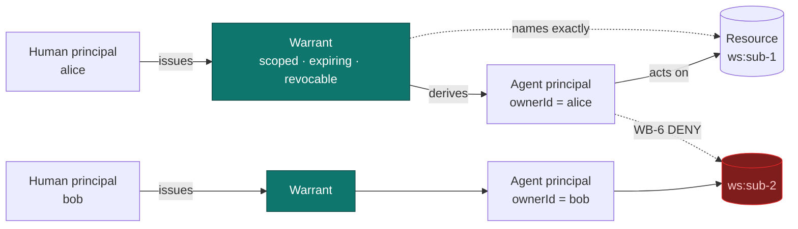
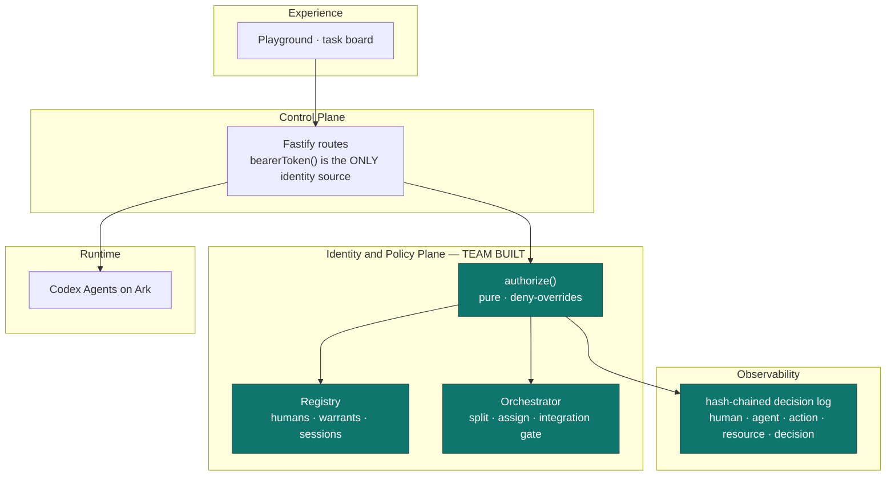

# WARRANT — delegation and authorization for multi-agent fan-out

**CodeJam Track #5 · Selected middleware track: B — The Bouncer**

> **One sentence.** When one task is fanned out to many Agents, each acting for a
> different human, "may this Agent touch this resource?" stops being a global question and
> becomes a per-delegation one — WARRANT makes that delegation explicit, scoped, expiring,
> revocable, and enforced in the backend.

| | |
| --- | --- |
| **Track** | B — The Bouncer. Exactly one judged track, per §3. |
| **Humans** | `alice`, `bob`, plus an `orchestrator` principal. Mock, as §8 permits. |
| **Agent principals** | One per subtask, **derived from a warrant** — never standalone. |
| **Protected resources** | Each subtask workspace (`ws:<id>`) and the shared `branch:integration`. |
| **Required denial** | Alice's Agent → Bob's workspace ⇒ `WB-6.cross-owner-denied`, HTTP 403. |
| **Revocation** | Owner revokes a live warrant; the very next action is refused. |
| **Success test (§3)** | *"changing a user ID in the browser request cannot bypass the authorization decision."* |
| **Evidence** | 202 tests. `npm run demo:warrant` prints the whole story. |

---

## 1. Why fan-out is the interesting version of Track B

The obvious Track B submission is a login screen plus an ownership column on a mock table.
§3 anticipates it: *"A login screen alone is not sufficient."*

Fan-out makes the problem genuinely hard, and it is the shape real agent platforms take:

- **N humans, N agents, one repository.** Alice owns "implement the limiter", Bob owns
  "add config validation". Each has an Agent. Neither Agent should see the other's work.
- **The orchestrator is a confused deputy waiting to happen.** A "daddy agent" that can
  read every workspace and merge everything is precisely the ambient-authority antipattern
  this plane exists to remove. Ours holds **no** workspace authority at all.
- **Authority must expire and be revocable.** A human who reassigns a subtask needs the
  previous Agent to stop working *immediately*, not at the end of the run.

## 2. The delegation chain



A warrant is the **only** source of Agent authority. There is no ambient permission
anywhere in the design: an Agent with no warrant can do nothing at all (`WB-1.no-warrant`),
which is default-deny stated as a data model rather than as a rule.

```ts
interface Warrant {
  id: string;
  humanId: string;        // who delegated
  agentId: string;        // who may act
  subtaskId: string;      // what for
  scopes: WarrantScope[]; // what it may do
  resources: string[];    // over exactly what
  issuedAt: string;
  expiresAt: string;      // authority is time-bound
  revokedAt: string | null;
  revokedReason: string | null;
}
```

## 3. Where it sits



The PDP is a **pure function** — no I/O, no clock, no registry lookups. Everything it needs
is resolved by the caller and passed in as `facts`. That is why every denial in §5 is a
table-driven unit test that runs with no server, no container and no network.

## 4. The success test, and why it holds structurally

> *"changing a user ID in the browser request cannot bypass the authorization decision."*

It holds because **no code path reads an identity from client input**. The only identity
source in the entire route module is:

```ts
function bearerToken(request: FastifyRequest): string | undefined {
  const header = request.headers.authorization ?? "";
  return header.startsWith("Bearer ") ? header.slice(7) : undefined;
}
```

resolved through `Registry.resolveSession`, which compares in constant time against issued
session tokens. A forged `X-Acting-User`, `?humanId=`, or body field is not *rejected* — it
is never *consulted*. There is nothing to forge because nothing is read.

The same discipline applies to warrants: `check()` looks up the warrant **by agent id**,
never by a client-supplied warrant id, so a caller cannot nominate which authority
authorises it.

Asserted by `warrant/scenario.test.ts`, which attacks all four vectors at once:

```ts
const forged = await app.inject({
  method: "POST",
  url: "/api/warrant/tasks/" + taskId + "/integrate?humanId=human:orchestrator",
  headers: {
    authorization: "Bearer " + aliceToken,
    "x-acting-user": "human:orchestrator",
    "x-user-id": "human:orchestrator",
  },
  payload: { humanId: "human:orchestrator", isOrchestrator: true },
});
expect(forged.statusCode).toBe(403);
expect(forged.json().decision.humanId).toBe("human:alice");  // still alice
```

## 5. The rules

Deny-overrides on a default-deny base, same algebra as the AEGIS engine.

| Rule | Fires when | Severity |
| --- | --- | --- |
| `WB-1.no-warrant` | No warrant authorises this Agent | deny |
| `WB-1.warrant-agent-mismatch` | Warrant was issued to a different Agent | deny |
| `WB-2.warrant-revoked` | Owner revoked it — checked before everything else | deny |
| `WB-3.warrant-expired` | Past `expiresAt` | deny |
| `WB-4.scope-not-granted` | Action needs a scope the warrant lacks | deny |
| `WB-5.resource-outside-warrant` | Resource is not in the granted set | deny |
| **`WB-6.cross-owner-denied`** | **Agent acts for A; resource belongs to B** | **deny** |
| `WB-7.integrate.orchestrator-only` | Non-orchestrator tries to merge | deny |
| `WB-8.integrate.unapproved-subtask` | An owner has not approved yet | deny |
| `WB-9.approval-not-owner` | Someone approves a subtask they do not own | deny |
| `WB-10.revoke-not-issuer` | Someone revokes a warrant they did not issue | deny |
| `WB-0.*` | The explicit permits | allow |

**WB-6 is stated separately even though WB-5 would also catch it.** The audit record then
names the actual problem — *"Agent acts for human:alice but this workspace belongs to
human:bob"* — instead of a generic scope failure. A judge reads the reason, not the code.

## 6. The orchestrator has no special power

The orchestrator can split, assign and integrate. It **cannot**:

- read or write any subtask workspace — it holds no warrant for one;
- integrate anything but `branch:integration` (`WB-7.integrate.wrong-resource`);
- integrate before **every** owner has approved their own subtask (`WB-8`).

This is the deliberate answer to "one big daddy agent that combines everything". An
orchestrator with ambient authority would be a confused deputy: the one principal that can
read everything becomes the way to reach everything.

> **Scope note.** Task splitting and model routing are orchestration *scaffolding*, not the
> judged surface — §8 puts workflow editors out of scope. They exist so the fan-out the
> authorization plane secures is realistic. `RuleSplitter` is deterministic and used by
> every test; `ArkSplitter` calls the Volcengine Ark Responses API and **falls back to the
> rule splitter on any failure**, because a planner outage must not take the platform down.

### 6.1 The denial is physical as well as logical

A decision that only refuses a *request* is worth little if the files are sitting
there anyway. Each subtask now owns a real directory, and the warrant determines
which single directory is bound into that Agent's container:

```
no live warrant   ->  no RunnerRequest  ->  no container at all
live warrant      ->  exactly one mount ->  siblings absent from the namespace
```

Two independent properties, either of which holds if the other breaks:

| | Mechanism | Fails closed because |
| --- | --- | --- |
| **Logical** | `WB-6.cross-owner-denied` refuses the request | the PDP is default-deny |
| **Physical** | Bob's directory is bound at no path in Alice's container | you cannot open a file that is not in your mount namespace |

`assertWorkspaceIsolation` runs immediately before spawn and refuses three
distinct escapes — blocking only the obvious one is how a control like this
quietly stops working:

1. **a sibling bound directly** — `src` is another subtask's path;
2. **the shared parent bound** — no sibling path appears literally, yet every
   sibling is exposed through one mount, *including ones created later*;
3. **the workspace mount redirected** — `dst=/workspace` pointing somewhere other
   than the path the warrant names.

Escape 2 is the one worth dwelling on. With siblings already present the first
rule happens to catch it, so the parent rule looks redundant — it earns its place
only on a single-subtask task, where the exposure is of subtasks that *do not
exist yet*. `isolation.test.ts` asserts it in exactly that case.

Revocation now has teeth at both layers: once a warrant is revoked the binder
produces no `RunnerRequest` at all (`WB-1.no-live-warrant`), so there is no
container to sandbox.

> **Still honest about the boundary.** These are assertions over the generated
> `argv`, verified in CI without a daemon. A live container run under the full
> profile has not yet been executed — that remains open, and is listed in §8.

## 7. Evidence

Every decision — allow and deny — is appended to a hash-chained log carrying the five-tuple
Track B requires:

```json
{
  "human": "human:alice",
  "agent": "agent_96d6668e…",
  "action": "workspace.read",
  "resource": "ws:sub_7e56fb97…",
  "decision": "Deny",
  "warrant": "wrt_e5ed27ea…"
}
```

`hash_i = SHA256(hash_{i-1} || canonicalJson(event_i))`, so tampering with record *i*
invalidates every record after it. `GET /api/warrant/events` returns `chainValid`. This is
tamper-**evident**, not tamper-resistant: host root can rewrite the whole chain.

### Test coverage

| Area | Tests |
| --- | --- |
| PDP rules, registry, expiry, revocation | 21 (`warrant/policy.test.ts`) |
| End-to-end over real HTTP, incl. the success test and trace access control | 16 (`warrant/scenario.test.ts`) |
| Splitter, Ark parsing, model routing, resources | 21 (`warrant/splitter.test.ts`) |
| Physical workspace isolation | 13 (`warrant/isolation.test.ts`) |
| Retained Track C (AEGIS), incl. T6 and T7 controls | 90 |
| Baseline, untouched | 12 |
| **Total** | **202, all passing** |

## 8. Limitations, and what we would do next

Stated plainly, per §1: *"explain trade-offs and known limitations without pretending the
POC is production-ready."*

| # | Limitation | Why | Next |
| --- | --- | --- | --- |
| **L1** | **Human authentication is mock.** Anyone who can reach the server may open a session as `alice`. | §8 permits mock users; the judged property is what happens *after* delegation. | OIDC / Volcengine IAM. `HumanPrincipal` gains `sub`, `aud`, `exp`; nothing else changes. |
| ~~L2~~ | ~~Workspaces are authorization objects, not isolated checkouts.~~ **Closed — see §6.1.** | — | Done: a warrant now determines which single directory is bound into the Agent's container. |
| **L3** | **Registry is in-memory.** Warrants do not survive a restart. | Matches the starter kit's single-process `JsonStore`. | Postgres with row-level security keyed on `humanId`. |
| **L4** | **No delegation depth.** An Agent cannot sub-delegate. | Deliberate for a 3-day build — depth needs attenuation rules to stay safe. | Macaroon-style caveats; a child warrant may only narrow its parent. |
| **L5** | **Audit chain is local.** | Tamper-evident on one host only. | Append to remote WORM storage. |
| **L6** | **Ark splitter is unverified against a live endpoint.** Parsing, fallback and path de-duplication are tested; the network call is not. | No Ark key in CI. | Run once with a real key before the demo. |
| **L7** | **No live container run under the profile.** Isolation is asserted over the generated `argv`, not observed in a running namespace. | Needs the daemon plus the runtime image. | Run one subtask end to end and `docker exec` a read of a sibling path to watch it fail. |

## 9. Acceptance checklist (§7)

- [x] The repository names **exactly one** selected track — B, in the README, this document, and demo slide 1.
- [x] A reviewer can create/select an Agent and run a task from the browser — baseline journey untouched.
- [x] The middleware executes in a **real backend path** — every decision is a Fastify route calling the PDP; the UI never decides.
- [x] The demo includes a **positive** case and a **denial** — beats 3 and 4 of `npm run demo:warrant`.
- [x] No secret in source, browser state, logs or traces — session tokens are opaque and random; the audit log is redacted.
- [x] README carries setup steps and known limitations.
- [x] **Track B gate:** cross-user access is denied by the backend, and the decision identifies human, Agent, action and resource.

---

<sub>WARRANT · built on Volc Agent Launchpad · CodeJam Track #5 v2 · Track B — The Bouncer</sub>
