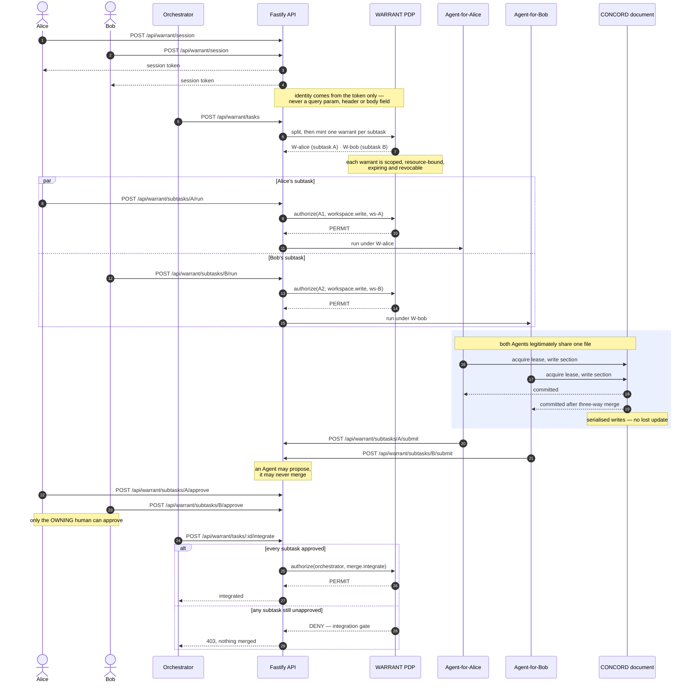

# Workflow

Volc Agent Launchpad + **WARRANT** — a delegation and authorization plane for
multi-agent fan-out. One task is split into subtasks; each subtask has one
accountable human and one Agent acting for them under a scoped, expiring,
revocable *warrant*.

There are two workflows in this repository and they are easy to confuse:

| | |
|---|---|
| **[Product workflow](#1-product-workflow)** | How a task moves through the system at runtime |
| **[Developer workflow](#2-developer-workflow)** | How you build, verify and run it on your machine |

---

## 1. Product workflow

### 1.1 The path a task takes

```
sign in  →  split  →  delegate  →  act  →  submit  →  approve  →  integrate
             │          │          │                    │
             │          │          └── every access decided by the PDP
             │          └── one warrant minted per subtask
             └── orchestrator.plan() + Ark splitter
```

Each step, with the endpoint that drives it:

| # | Step | Endpoint | What actually happens |
|---|------|----------|----------------------|
| 1 | **Sign in** | `POST /api/warrant/session` | A human gets a session token. Identity is derived from that token and **nothing else** — not a query param, not a header, not a body field. |
| 2 | **Split** | `POST /api/warrant/tasks` | The orchestrator breaks one task into subtasks, assigns each an owner and a model (`model-policy.ts` tier routing). |
| 3 | **Delegate** | *(implicit in the split)* | One `Warrant` is minted per subtask: scoped, resource-bound, time-bound, revocable. |
| 4 | **Act** | `POST /api/warrant/subtasks/:id/run` | The Agent runs in its own workspace. Every access is checked against its warrant. |
| 5 | **Submit** | `POST /api/warrant/subtasks/:id/submit` | The Agent proposes its work. It cannot merge it. |
| 6 | **Approve** | `POST /api/warrant/subtasks/:id/approve` | The *owning human* approves. Only they can. |
| 7 | **Integrate** | `POST /api/warrant/tasks/:id/integrate` | The orchestrator merges — and is refused if any subtask is unapproved. |

### 1.2 The same workflow, as a sequence

Two humans, two Agents, one shared document, one task. This is the fan-out story
end to end — who calls what, and who is allowed to say yes.



For the authorization detail behind each `authorize(...)` call — including the
cross-owner denial and mid-flight revocation — see
[`architecture_Diagram.md`](architecture_Diagram.md) §2 and §4.

### 1.3 Subtask state machine

```
assigned ──▶ in_progress ──▶ submitted ──▶ approved ──▶ integrated
    ▲             │              │
    └─────────────┴──────────────┘
              blocked
   (revocation sends the subtask back for reassignment)
```

Defined in `apps/server/src/warrant/types.ts` as `SubtaskState`.

### 1.4 What a warrant is

A warrant is delegation made explicit. **Absence of a warrant is absence of
authority** — there is no ambient permission anywhere in the design.

```ts
interface Warrant {
  humanId, agentId, subtaskId   // who delegated, who acts, for what
  origin: "subtask" | "share"   // fan-out, or a human sharing a document
  scopes:    WarrantScope[]     // workspace:read | workspace:write
                                // model:invoke | merge:propose | comment:write
  resources: string[]           // canonical ids — nothing else is reachable
  issuedAt, expiresAt           // time-bound
  revokedAt, revokedReason      // revocable mid-flight
}
```

An Agent's authority is **always strictly narrower** than its owner's.

### 1.5 The four guarantees this workflow buys

| Guarantee | Mechanism | Where |
|---|---|---|
| Alice's Agent can never reach Bob's work | PDP denial **plus** no sibling mount — Bob's files exist at no path in the namespace | `WB-6.cross-owner-denied` |
| Unapproved work cannot be merged | Integration gate | `WB-7` / `WB-8` |
| A human can pull an Agent's authority mid-flight | Revocation — the next action is refused and no container is built | `POST /api/warrant/revoke` |
| Concurrent edits to one file never silently lose an update | CONCORD — serialised writes + three-way merge | `apps/server/src/concord/` |

### 1.6 Supporting planes

- **CONCORD** (`/api/concord/*`) — shared documents: leases, sections, three-way
  merge, conflict resolution, blame, history, presence.
- **REVIEW** (`/api/review/*`) — comments, consultations, reiterations.
- **LIVE** (`/api/live/*`) — activity feed, workspace streams, board.
- **AEGIS** (`/api/aegis/*`) — Track C sandboxing, retained as defence in depth
  but **not** the claimed track: policy engine, egress broker, seccomp,
  budget ledger, circuit breaker, kill switch, attestation.

### 1.7 See it without an Ark key

```bash
npm run demo:warrant     # 10 beats, ~2s, no API key needed
```

The beats: three humans sign in → one task is split → Alice's Agent works inside
its warrant → the same Agent reaches for Bob's workspace and is **denied** → the
denial is shown to be *physical*, not just a decision → both Agents edit one
document with no lost update → forging the user id changes nothing → the
orchestrator is blocked from merging unapproved work → Alice revokes mid-flight
→ every decision is replayed as one verifiable chain.

---

## 2. Developer workflow

### 2.1 Verify

```bash
npm run check          # typecheck + 403 tests + build
npm run test           # tests only
npm run demo:warrant   # the Track B story, no Ark key needed
```

### 2.2 Run

The intended path is **Docker Compose**, because the configuration is written
for it:

```bash
docker compose up
```

To run outside Docker, on port 3003:

```bash
cd ~/tiktok/PleaseHireMe
set -a && . ./.env && set +a          # see gotcha 1 — this is not optional
NODE_ENV=production HOST=127.0.0.1 PORT=3003 APP_AUTH_TOKEN= AEGIS_ENABLED=false \
  APP_DATA_DIR="$PWD/.data" AGENT_WORKSPACE_ROOT="$PWD/workspaces" \
  CODEX_HOME="$PWD/codex-home" npm start
```

Or in dev mode with hot reload (server on `PORT`, Vite on 5173 proxying `/api`):

```bash
npm run dev
```

### 2.3 Four gotchas that will cost you an afternoon

These are real, each one hides the next, and the error messages point at the
wrong thing.

**1. `.env` is never read by the app.**
There is no `dotenv` dependency and no `loadEnvFile()` call anywhere in the
server. `loadConfig()` reads `process.env` only. The `.env` file is consumed
**exclusively** by `docker-compose.yml` via `env_file:`. Pasting a key into
`.env` and running `npm start` does nothing at all. Source it first:
`set -a && . ./.env && set +a`.

**2. `NODE_ENV=production` is required to serve the web UI.**
The static handler is registered only under that flag (`app.ts`). Without it you
get a bare API and `/` returns 404.

**3. `.env` is full of Docker-only addresses.**
`APP_DATA_DIR=/app/data`, `AGENT_WORKSPACE_ROOT=/app/workspaces`,
`CODEX_HOME=/app/codex-home` and `AEGIS_BROKER_URL=http://aegis-broker:8080`
only resolve inside Compose. Outside it, `aegis-broker` does not resolve and
Codex hangs on connect. Override all four.

**4. On WSL, `codex` may be the Windows binary.**
If `which codex` points into `/mnt/c/...`, runs die with
`Missing optional dependency @openai/codex-linux-x64`. Install the Linux build
without sudo:

```bash
npm install -g --prefix "$HOME/.local" @openai/codex@latest
```

### 2.4 Troubleshooting

| Symptom | Cause | Fix |
|---|---|---|
| `503 Ark is not configured` | `ARK_API_KEY` / `ARK_MODEL` never reached the process | Source `.env` (gotcha 1) |
| `/` returns 404, API works | Static handler not registered | Set `NODE_ENV=production` |
| `APP_AUTH_TOKEN must contain at least 24 characters` | Production + non-loopback `HOST` with a placeholder token | Bind `127.0.0.1`, or set a real token |
| `401` on every `/api/*` call | `APP_AUTH_TOKEN` is set, so auth is on | Send `Authorization: Bearer <token>`, or clear the var on loopback |
| Codex hangs, no output | `base_url` is `http://aegis-broker:8080`, unresolvable outside Compose | Set `AEGIS_BROKER_URL`, or `AEGIS_ENABLED=false` |
| `403 Run capability is unknown or its run has ended` | Aegis broker mints capabilities for **container** runs; you are on `local-process` | `AEGIS_ENABLED=false`, or use `docker compose up` |
| `Missing optional dependency @openai/codex-linux-x64` | Windows `codex` shim on the WSL PATH | Install the Linux build (gotcha 4) |
| `401 The API key doesn't exist` | Ark rejects the key itself — revoked, wrong account, or wrong region | Issue a fresh key in the Volcengine Ark console |

Verify a key independently of the app:

```bash
curl -s -X POST https://ark.cn-beijing.volces.com/api/v3/chat/completions \
  -H "Authorization: Bearer $ARK_API_KEY" -H 'Content-Type: application/json' \
  -d '{"model":"'"$ARK_MODEL"'","messages":[{"role":"user","content":"say OK"}]}'
```

### 2.5 Configuration that matters

| Variable | Default | Note |
|---|---|---|
| `HOST` / `PORT` | `0.0.0.0` / `3000` | Non-loopback + production demands a real `APP_AUTH_TOKEN` |
| `APP_AUTH_TOKEN` | *(unset)* | ≥24 chars, URL-safe. Shared bearer, **not** user identity |
| `ARK_API_KEY` / `ARK_MODEL` | — | Model access. Without them, messages return 503 |
| `ARK_BASE_URL` | `https://ark.cn-beijing.volces.com/api/v3` | Region matters |
| `RUNTIME_PROVIDER` | `local-process` | or `container` |
| `AEGIS_ENABLED` | `true` | Off for local-process runs outside Docker |
| `AEGIS_BROKER_URL` | `http://host.docker.internal:8788` | Compose overrides this to `aegis-broker:8080` |

### 2.6 Storage layout

```
.data/launchpad.json      Agent, message and Run metadata (JsonStore, single process)
workspaces/<AgentID>/     Agent-created files
workspaces/.deleted/      Archived deleted workspaces
codex-home/config.toml    Generated — edit environment variables, not this file
vault/                    AEGIS secret store
```

### 2.7 Security notes

Single-user proof of concept. Human sign-in is **mock** — anyone who can reach
the server can claim to be `alice`. `APP_AUTH_TOKEN` is a shared bearer for
demo protection, not identity or authorization. Do not use production data or
credentials. See `SECURITY.md` and `docs/THREAT_MODEL.md`.

---

**Related:** [`docs/MASTER.md`](docs/MASTER.md) (start here) ·
[`docs/WARRANT_TRACK_B.md`](docs/WARRANT_TRACK_B.md) ·
[`docs/ARCHITECTURE.md`](docs/ARCHITECTURE.md) ·
[`architecture_Diagram.md`](architecture_Diagram.md)
